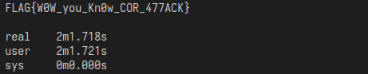

# Correlation Attack  
首先看題目的程式碼:  
```py
import random

from secret import FLAG

class LFSR:
    def __init__(self, tap, state):
        self._tap = tap
        self._state = state

    def getbit(self):
        f = sum([self._state[i] for i in self._tap]) & 1
        x = self._state[0]
        self._state = self._state[1:] + [f]
        return x

class triLFSR:
    def __init__(self, lfsr1, lfsr2, lfsr3):
        self.lfsr1 = lfsr1
        self.lfsr2 = lfsr2
        self.lfsr3 = lfsr3

    def getbit(self):
        x1 = self.lfsr1.getbit()
        x2 = self.lfsr2.getbit()
        x3 = self.lfsr3.getbit()
        return x2 if x1 else x3

lfsr1 = LFSR([0, 13, 16, 26], [random.randrange(2) for _ in range(27)])
lfsr2 = LFSR([0, 5, 7, 22], [random.randrange(2) for _ in range(23)])
lfsr3 = LFSR([0, 17, 19, 24], [random.randrange(2) for _ in range(25)])
cipher = triLFSR(lfsr1, lfsr2, lfsr3)

flag = map(int, ''.join(["{:08b}".format(c) for c in FLAG]))

output = []

for b in flag:
    output.append(cipher.getbit() ^ b)

for _ in range(200):
    output.append(cipher.getbit())

print(output)
```

## Discovery
這題使用了三個LFSR(Linear Feedback Shift Register)來做加密，  
並且每個LFSR有各自的tap與initial state。  
透過題目給的`output.txt`可以得知，整個output長度爲432個bits。  
觀察題目最後的部分，這432個bits中，最後的200個bits是由LFSR產生的，  
而前面的232個bits則是flag與LFSR做XOR後獲得的。  
也就是flag的長度應該是 $\frac{232} {8} = 29$ 個字元。  

## Correlation Attack
correlation attack就是利用枚舉的方式，判斷關聯程度後反推出initial state。  
因爲三個LFSR之間互相影響，因此output應該同時會有與 $X_2$ 75%的相似性  
以及 $X_3$ 75%的相似性。  
這樣一來，原本 $(2^{32})^3$ 的可能性被降低到了 $3 \times 2^{32}$種，就可以在短時間內破解開來。  

## Solve
雖然計算量只剩下 $3 \times 2^{32}$ 種，但如果使用python仍然會需要大量的時間，  
因此改用速度較快的程式語言會較爲方便。這邊使用C++。  

### Step 1.
先枚舉state然後計算 $X_2$跟 $X_3$的相似程度大於70%，則可以推斷這個state就是初始狀態的可能性很高。  
```cpp
#define SIZE 432

std::vector<uint64_t> get_state(uint64_t tap, uint64_t size) {
    int output[SIZE];
    std::vector<uint64_t> states;
    for (uint64_t state = 0; state < ((uint64_t)1 << size); state++) {
        LFSR lfsr = LFSR(state, tap, size);
        for (int i = 0; i < SIZE; i++) {
            output[i] = lfsr.getbit();
        }

        double accuracy = cal_cor(&output[SIZE - 200], &result[SIZE - 200]);
        if (accuracy > 0.7) {
            states.push_back(state);
        }
    }
    return states;
}

int main() {
    std::vector<std::vector<uint64_t>> states;
    uint64_t size[3] = {27, 23, 25};
    uint64_t tap[3] = {
        (1 << 26) | (1 << 16) | (1 << 13) | 1,
        (1 << 22) | (1 << 7) | (1 << 5) | 1,
        (1 << 24) | (1 << 19) | (1 << 17) | 1,
    };

    for (int i = 1; i < 3; i++) {
        states.push_back(get_state(tap[i], size[i]));
    }
...
```

### Step 2.
枚舉三個LFSR，直到出現與output最後200個bit非常像的結果(幾乎一樣)  
那就可以得知這就是原先加密時的sequence。  
```cpp
...
for (uint64_t state1 : states[0]) {
    for (uint64_t state2 : states[1]) {
        for (uint64_t state0 = 0; state0 < ((uint64_t)1 << size[0]);
                state0++) {
            LFSR lfsr0 = LFSR(state0, tap[0], size[0]);
            LFSR lfsr1 = LFSR(state1, tap[1], size[1]);
            LFSR lfsr2 = LFSR(state2, tap[2], size[2]);
            int x0, x1, x2;
            for (int i = 0; i < SIZE; i++) {
                x0 = lfsr0.getbit();
                x1 = lfsr1.getbit();
                x2 = lfsr2.getbit();
                output[i] = x0 ? x1 : x2;
            }
            double accuracy =
                cal_cor(&output[SIZE - 200], &result[SIZE - 200]);
            if (accuracy >= 0.99) {
                goto answer;
            }
        }
    }
}
```

### Step 3.
得到原先的sequence後，與output做XOR就可以還原出flag了。  
```cpp
answer:
    std::vector<uint8_t> flag_bit(SIZE - 200);
    for (int i = 0; i < flag_bit.size(); i++) {
        flag_bit[i] = output[i] ^ result[i];
    }
    std::string flag_str;
    for (int i = 0; i < flag_bit.size(); i += 8) {
        int value = 0;
        for (int t = 0; t < 8; t++) {
            value += flag_bit[i + t] << (8 - 1 - t);
        }
        flag_str += char(value);
    }
    std::cout << flag_str << std::endl;
```

### Result
執行結果:  
