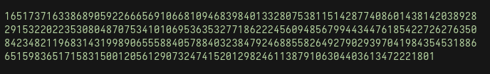
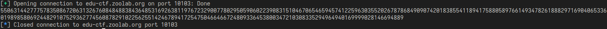
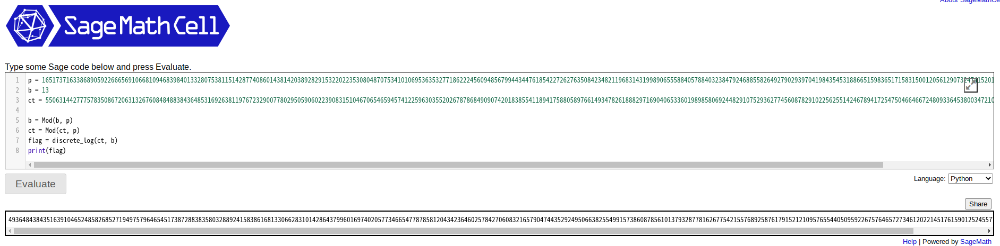
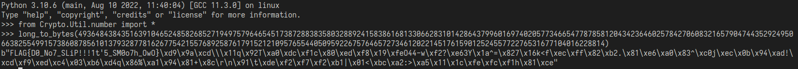

# Discrete Logarithm
這個題目是要解離散對數問題，題目code如下:  
```python
#! /usr/bin/python3
from Crypto.Util.number import isPrime, bytes_to_long
import os

from secret import FLAG

p = int(input("give me a prime").strip())
if not isPrime(p):
    print("Do you know what is primes?")
if p.bit_length() != 1024:
    print("Bit length need to be 1024")

b = int(input("give me a number").strip())
flag = bytes_to_long(FLAG + os.urandom(p.bit_length() // 8 - len(FLAG)))

print('The hint about my secret:', pow(b, flag, p))
```

## Find P
這邊希望找一個smooth的P，找的方式是使用很多個小的質數相乘，直到1024位後+1，  
檢查是不是質數，如果不是就重新開始，直到找到P爲止。  

程式碼如下:
```python
from Crypto.Util.number import isPrime
import random

while True:
    p = 1
    while p.bit_length() < 1024:
        r = random.randint(2, 1024)
        if not isPrime(r):
            continue
        p *= r

    p += 1
    if p.bit_length() != 1024:
        continue
    if isPrime(p):
        break

print(p)
```
這邊算出的P是下面這個數字:  



## Find b
取一個小質數b，這邊取13

## Get hint
有了P與b後，向伺服器要hint，使用下面的code:
```python
from Crypto.Util.number import *
import pwn

p = 1651737163386890592266656910668109468398401332807538115142877408601
43814203892829153220223530804870753410106953635327718622245609485679944
34476185422726276350842348211968314319989065558840578840323847924688558
26492790293970419843545318866515983651715831500120561290732474152012982
46113879106304403613472221801
b = 13

r = pwn.remote("edu-ctf.zoolab.org", 10103)

r.recvuntil(b"give me a prime")
r.sendline(str(p).encode())
r.recvuntil(b"give me a number")
r.sendline(str(b).encode())

r.recvuntil(b"The hint about my secret:")
ct = int(r.recvline().strip())
print(ct)
```
伺服器回傳hint  


## Find FLAG
有了P, b與hint後，就可以使用sage來解開flag  
  

最後再根據得出的flag，使用long_to_bytes就可以還原出flag  
