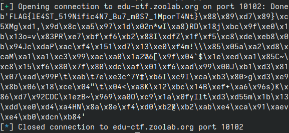

# Least Significant Bit Oracle Attack
這題是利用Least Significant Bit Oracle Attack來破解RSA。  
首先看題目的code:
```py
#! /usr/bin/python3
from Crypto.Util.number import bytes_to_long, getPrime, long_to_bytes
import os

from secret import FLAG

p = getPrime(1024)
q = getPrime(1024)
n = p * q
phi = (p - 1) * (q - 1)
e = 65537
d = pow(e, -1, phi)

m = bytes_to_long(FLAG + os.urandom(256 - len(FLAG)))
assert m < n
enc = pow(m, e, n)
print(n)
print(e)
print(enc)
while True:
    inp = int(input().strip())
    pt = pow(inp, d, n)
    print(pt % 3)
```

觀察一下大致可以知道這是經典的RSA，而伺服器會回傳明文mod 3的值。  

## Mod 2
先從mod 2的情況下來看:  
mod 2實際上就是bitwise and `0x1`，亦即得出最後一個bit。  
在一開始先將密文傳送給伺服器，那就可以直接得到明文的最後一個bit。  
接下來就是一步一步往前回推出每個bit，得到所有bit之後就得到明文了。  
證明借用講義的圖片:  


因爲是一個bit一個bit解開，所以時間複雜度爲 $O(log_2{n}) = O(log{n})$ ，其中n是明文的bit length

## Mod 3
mod 3實際上跟mod 2是同一個概念  
只要把2改成3基本上就可以了。  
時間複雜度一樣是 $O(logn)$ 但可能會比mod 2稍微快一點點。

## Solve
依據上面的理論，寫出以下程式碼:
```py
import pwn
from Crypto.Util.number import inverse, long_to_bytes

r = pwn.remote("edu-ctf.zoolab.org", "10102")
n = int(r.recvline().strip().decode())
e = int(r.recvline().strip().decode())
enc = int(r.recvline().strip().decode())

prev = 0 # previous sum
pt = 0 # plain text
xi = 0 # ith bit
while True:
    inv = inverse(3, n) # find inverse
    c1 = (enc * pow(inv, e*xi, n)) % n
    r.sendline(str(c1).encode())
    lsb = int(r.recvline().strip().decode())
    curr = (lsb - (prev*inv) % n) % 3
    prev = prev*inv + curr # add current to previous
    pt = pow(3, xi)*curr + pt
    
    # break when flag was found
    if b"FLAG" in long_to_bytes(pt):
        break
    xi += 1

print(long_to_bytes(pt))
```

執行上面的程式，等待一點時間後，即可獲得flag:  
