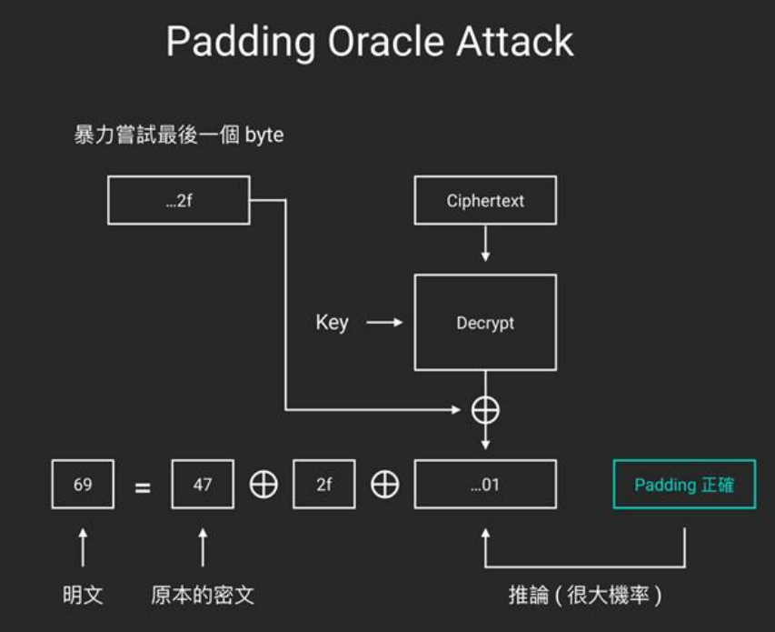
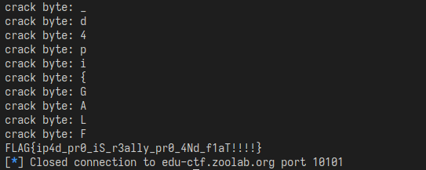

# Padding Oracle Attack
題目code如下:
```py
#! /usr/bin/python3
from Crypto.Cipher import AES
import os

from secret import FLAG

def pad(data, block_size):
    data += bytes([0x80] + [0x00] * (15 - len(data) % block_size))
    return data

def unpad(data, block_size):
    if len(data) % block_size:
        raise ValueError

    padding_len = 0
    for i in range(1, len(data) + 1):
        if data[-i] == 0x80:
            padding_len = i
            break
        elif data[-i] != 0x00:
            raise ValueError
    else:
        raise ValueError

    return data[:-padding_len]

key = os.urandom(16)
cipher = AES.new(key, AES.MODE_CBC)
ct = cipher.encrypt(pad(FLAG, AES.block_size))
iv = cipher.iv
print((iv + ct).hex())

while True:
    try:
        inp = bytes.fromhex(input().strip())
        iv, ct = inp[:16], inp[16:]
        cipher = AES.new(key, AES.MODE_CBC, iv)
        pt = unpad(cipher.decrypt(ct), AES.block_size)
        print("Well received :)")
    except ValueError:
        print("Something went wrong :(")

```
根據題目可以看出這題是要利用padding oracle attack破解AES  
仔細觀察padding的部分，會發現他的padding並非標準的PKCS，而是使用自己定義的padding方式。  
根據code可以得知，padding是先在尾部加一個`0x80`，並填充`0x00`直到長度爲16的倍數爲止。

## Detail
Padding Oracle Attack的實現原理是利用AES CBC mode中每個block會跟前面的block XOR的特性，以及利用padding成功與否來判斷改出來的byte是什麼。  
常見的PKCS是使用剩下的長度來選擇padding的值，因此可以很容易把padding改掉來做判斷  
因爲不太會講解所以放一張上課的投影片來輔助參考  
{width="60%"}

## Solve
簡單的想法就是先找出原本資料padding多少個，到哪邊爲止是padding  
具體找法如下:  

1.從最後一個byte開始，把byte改成`0x00`到`0xFF`，如果有兩次是padding成功的，  
那就代表這個byte原本是`0x00`，因爲如果不小心把`0x80`改掉了，那就會出現padding錯誤  
(除非改成`0x80`自己)。根據這個想法，從最後一個byte開始往前找，直到有一個byte在  `0x00`到`0x80`中只有一次是padding成功的，那這個byte就是`0x80`  
  
2.接下來從最後一個block開始嘗試，從padding以前的部分開始，把原本`0x80`的位置先XOR `0x80`，這樣就會讓明文的那個位置變成`0x00`，然後開始翻前面那個byte，  
直到padding成功就表示明文部分被改成`0x80`了。  
那麼只要再將此結果XOR前一個block的位置再XOR`0x80`就可以推回出原始明文的byte，  
再轉換爲ascii即可  
  
3.最後就是重複這個動作，把所有前面的block找完，就可以解出flag了。  

解題的code如下:  
(code裡面有三個部分，分別對照到上面解說的三個步驟)  
```py
import pwn

BLOCK_SIZE = 16

p = pwn.remote("edu-ctf.zoolab.org", "10101")

data = p.recvline().strip().decode("ascii")
data = bytearray.fromhex(data)
test = data.copy()

###################### part 1 ######################
pos = 0
# find 0x80
for i in range(1, 16):
    count = 0
    test = data.copy()
    for j in range(256):
        test[-i-BLOCK_SIZE] = j

        p.sendline(bytes(test.hex(), encoding="ascii"))
        if p.recvline() == b"Well received :)\n":
            count += 1
    # 0x80 position
    if count == 1:
        pos = i
        break


print(f"0x80 found at {pos}")
ans = ""
last_byte = 0
test = data.copy()

###################### part 2 ######################
# the last block
for j in range(pos, 16):
    test[-j-BLOCK_SIZE] ^= 0x80
    for i in range(256):
        test[-j-1-BLOCK_SIZE] = i

        p.sendline(bytes(test.hex(), encoding="ascii"))
        if p.recvline() == b"Well received :)\n":
            last_byte = i
            ans += chr(i ^ data[-j-1-BLOCK_SIZE] ^ 0x80)
            print("crack byte:", chr(i ^ data[-j-1-BLOCK_SIZE] ^ 0x80))
            break


###################### part 3 ######################
# remained blocks (except iv)
while len(data) > 32:
    data = data[:-BLOCK_SIZE]
    test = data.copy()

    # last byte of a block
    for i in range(256):
        test[-1-BLOCK_SIZE] = i
        p.sendline(bytes(test.hex(), encoding="ascii"))
        if p.recvline() == b"Well received :)\n":
            last_byte = i
            ans += chr(i ^ data[-1-BLOCK_SIZE] ^ 0x80)
            print("crack byte:", chr(i ^ data[-1-BLOCK_SIZE] ^ 0x80))
            break
    
    # other 15 bytes of block
    for j in range(1, 16):
        test[-j-BLOCK_SIZE] ^= 0x80
        for i in range(256):
            test[-j-1-BLOCK_SIZE] = i

            p.sendline(bytes(test.hex(), encoding="ascii"))
            if p.recvline() == b"Well received :)\n":
                last_byte = i
                ans += chr(i ^ data[-j-1-BLOCK_SIZE] ^ 0x80)
                print("crack byte:", chr(i ^ data[-j-1-BLOCK_SIZE] ^ 0x80))
                break


print(ans[::-1])
```

## Result
執行上面的程式碼後，可以從伺服器得到flag:  
