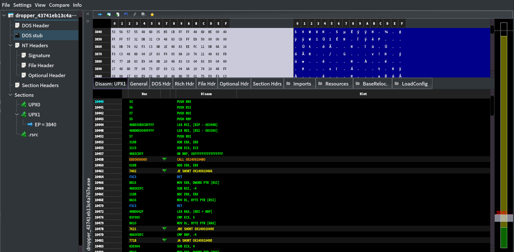
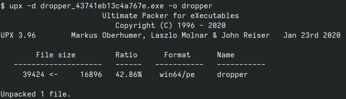
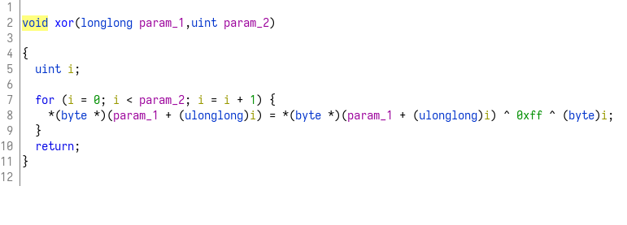
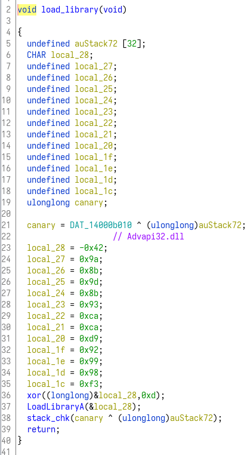
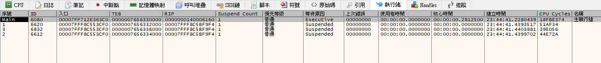

# dropper
首先先用pe-bear看看這個程式的一些資訊:  
  

這邊看到比較有用的資訊是他是被UPX加殼過的，因此先把殼解開再反組譯才看得到原本的程式。  

## UPX
使用upx把殼解開:  


## reverse
首先看到main function(太長了沒辦法截圖):  
```c
void main(void)

{
  int iVar1;
  undefined auStack1592 [32];
  undefined8 local_618;
  uint *local_610;
  uint local_608;
  longlong *buf;
  code *local_5f0;
  char *local_5e8;
  undefined8 *local_5e0;
  code *local_5d8;
  code *local_5d0;
  code *local_5c8;
  code *local_5c0;
  undefined8 *local_5b8;
  void **local_5b0;
  undefined8 *local_5a8;
  void **local_5a0;
  void **local_598;
  void **local_590;
  void **local_588;
  undefined8 *local_580;
  void **local_578;
  void **local_570;
  undefined8 *local_568;
  void **local_560;
  undefined8 *local_558;
  void **local_550;
  void **local_548;
  undefined8 *local_540;
  void **local_538;
  undefined8 *local_530;
  code *local_528;
  void **local_520;
  undefined8 *local_518;
  void **local_510;
  undefined8 *local_508;
  void **local_500;
  void **local_4f8;
  undefined8 *local_4f0;
  void **local_4e8;
  undefined8 *local_4e0;
  void **local_4d8;
  void **local_4d0;
  undefined8 *local_4c8;
  void **local_4c0;
  undefined8 *local_4b8;
  void **local_4b0;
  void **local_4a8;
  undefined8 *local_4a0;
  void **local_498;
  undefined8 *local_490;
  void **local_488;
  void **local_480;
  undefined8 *local_478;
  void **local_470;
  undefined8 *local_468;
  void **local_460;
  void **local_458;
  undefined8 *local_450;
  void **local_448;
  undefined8 *local_440;
  void **local_438;
  void **local_430;
  undefined8 *local_428;
  void **local_420;
  undefined8 *local_418;
  void **local_410;
  void **local_408;
  code *local_400;
  code *local_3f8;
  code *local_3f0;
  code *local_3e8;
  code *local_3e0;
  undefined8 local_3d8 [4];
  undefined8 local_3b8 [4];
  undefined8 local_398 [4];
  undefined8 local_378 [4];
  undefined8 local_358 [4];
  undefined8 local_338 [4];
  undefined8 local_318 [4];
  undefined8 local_2f8 [4];
  undefined8 local_2d8 [4];
  undefined8 local_2b8 [4];
  undefined8 local_298 [4];
  undefined8 local_278 [4];
  undefined8 local_258 [4];
  undefined8 local_238 [4];
  undefined8 local_218 [4];
  undefined8 local_1f8 [4];
  undefined8 local_1d8 [4];
  undefined8 local_1b8 [4];
  undefined8 local_198 [4];
  undefined8 local_178 [4];
  undefined8 local_158 [4];
  undefined8 local_138 [4];
  uint local_118 [2];
  undefined8 local_110;
  undefined advapi32dll;
  undefined local_107;
  undefined local_106;
  undefined local_105;
  undefined local_104;
  undefined local_103;
  undefined local_102;
  undefined local_101;
  undefined local_100;
  undefined local_ff;
  undefined local_fe;
  undefined local_fd;
  undefined local_fc;
  undefined Sleep;
  undefined local_f7;
  undefined local_f6;
  undefined local_f5;
  undefined local_f4;
  undefined local_f3;
  undefined kernel32dll;
  undefined local_ef;
  undefined local_ee;
  undefined local_ed;
  undefined local_ec;
  undefined local_eb;
  undefined local_ea;
  undefined local_e9;
  undefined local_e8;
  undefined local_e7;
  undefined local_e6;
  undefined local_e5;
  undefined local_e4;
  undefined RegCloseKey;
  undefined local_df;
  undefined local_de;
  undefined local_dd;
  undefined local_dc;
  undefined local_db;
  undefined local_da;
  undefined local_d9;
  undefined local_d8;
  undefined local_d7;
  undefined local_d6;
  undefined local_d5;
  undefined CryptEncrypt;
  undefined local_cf;
  undefined local_ce;
  undefined local_cd;
  undefined local_cc;
  undefined local_cb;
  undefined local_ca;
  undefined local_c9;
  undefined local_c8;
  undefined local_c7;
  undefined local_c6;
  undefined local_c5;
  undefined local_c4;
  undefined GetLastError;
  undefined local_bf;
  undefined local_be;
  undefined local_bd;
  undefined local_bc;
  undefined local_bb;
  undefined local_ba;
  undefined local_b9;
  undefined local_b8;
  undefined local_b7;
  undefined local_b6;
  undefined local_b5;
  undefined local_b4;
  undefined CryptHashData;
  undefined local_af;
  undefined local_ae;
  undefined local_ad;
  undefined local_ac;
  undefined local_ab;
  undefined local_aa;
  undefined local_a9;
  undefined local_a8;
  undefined local_a7;
  undefined local_a6;
  undefined local_a5;
  undefined local_a4;
  undefined local_a3;
  undefined RegCreateKeyA;
  undefined local_9f;
  undefined local_9e;
  undefined local_9d;
  undefined local_9c;
  undefined local_9b;
  undefined local_9a;
  undefined local_99;
  undefined local_98;
  undefined local_97;
  undefined local_96;
  undefined local_95;
  undefined local_94;
  undefined local_93;
  undefined RegSetValueExA;
  undefined local_8f;
  undefined local_8e;
  undefined local_8d;
  undefined local_8c;
  undefined local_8b;
  undefined local_8a;
  undefined local_89;
  undefined local_88;
  undefined local_87;
  undefined local_86;
  undefined local_85;
  undefined local_84;
  undefined local_83;
  undefined local_82;
  undefined CryptDeriveKey;
  undefined local_7f;
  undefined local_7e;
  undefined local_7d;
  undefined local_7c;
  undefined local_7b;
  undefined local_7a;
  undefined local_79;
  undefined local_78;
  undefined local_77;
  undefined local_76;
  undefined local_75;
  undefined local_74;
  undefined local_73;
  undefined local_72;
  undefined CryptCreateHash;
  undefined local_6f;
  undefined local_6e;
  undefined local_6d;
  undefined local_6c;
  undefined local_6b;
  undefined local_6a;
  undefined local_69;
  undefined local_68;
  undefined local_67;
  undefined local_66;
  undefined local_65;
  undefined local_64;
  undefined local_63;
  undefined local_62;
  undefined local_61;
  undefined CryptDestroyHash;
  undefined local_5f;
  undefined local_5e;
  undefined local_5d;
  undefined local_5c;
  undefined local_5b;
  undefined local_5a;
  undefined local_59;
  undefined local_58;
  undefined local_57;
  undefined local_56;
  undefined local_55;
  undefined local_54;
  undefined local_53;
  undefined local_52;
  undefined local_51;
  undefined local_50;
  undefined CryptAcquireContextW;
  undefined local_47;
  undefined local_46;
  undefined local_45;
  undefined local_44;
  undefined local_43;
  undefined local_42;
  undefined local_41;
  undefined local_40;
  undefined local_3f;
  undefined local_3e;
  undefined local_3d;
  undefined local_3c;
  undefined local_3b;
  undefined local_3a;
  undefined local_39;
  undefined local_38;
  undefined local_37;
  undefined local_36;
  undefined local_35;
  undefined local_34;
  longlong local_30;
  undefined8 local_28;
  longlong local_20;
  ulonglong canary;
  
  canary = DAT_14000b010 ^ (ulonglong)auStack1592;
  local_28 = 0;
  local_118[0] = 0;
  buf = (longlong *)0x0;
  local_5e8 = "CS_2022";
                    // Advapi32.dll
  advapi32dll = 0xbe;
  local_107 = 0x9a;
  local_106 = 0x8b;
  local_105 = 0x9d;
  local_104 = 0x8b;
  local_103 = 0x93;
  local_102 = 0xca;
  local_101 = 0xca;
  local_100 = 0xd9;
  local_ff = 0x92;
  local_fe = 0x99;
  local_fd = 0x98;
  local_fc = 0xf3;
  xor((longlong)&advapi32dll,0xd);
                    // Kernel32.dll
  kernel32dll = 0xb4;
  local_ef = 0x9b;
  local_ee = 0x8f;
  local_ed = 0x92;
  local_ec = 0x9e;
  local_eb = 0x96;
  local_ea = 0xca;
  local_e9 = 0xca;
  local_e8 = 0xd9;
  local_e7 = 0x92;
  local_e6 = 0x99;
  local_e5 = 0x98;
  local_e4 = 0xf3;
  xor((longlong)&kernel32dll,0xd);
                    // CryptAcquireContextW
  CryptAcquireContextW = 0xbc;
  local_47 = 0x8c;
  local_46 = 0x84;
  local_45 = 0x8c;
  local_44 = 0x8f;
  local_43 = 0xbb;
  local_42 = 0x9a;
  local_41 = 0x89;
  local_40 = 0x82;
  local_3f = 0x9f;
  local_3e = 0x87;
  local_3d = 0x91;
  local_3c = 0xb0;
  local_3b = 0x9d;
  local_3a = 0x9f;
  local_39 = 0x84;
  local_38 = 0x8a;
  local_37 = 0x96;
  local_36 = 0x99;
  local_35 = 0xbb;
  local_34 = 0xeb;
  xor((longlong)&CryptAcquireContextW,0x15);
  local_5b8 = local_1f8;
  local_5a8 = local_1d8;
  local_5b0 = (void **)pass_str(local_5b8,&CryptAcquireContextW);
  local_5a0 = local_5b0;
  local_598 = (void **)pass_str(local_5a8,&advapi32dll);
  local_5f0 = (code *)FUN_140001a00(local_598,local_5a0);
                    // GetLastError
  GetLastError = 0xb8;
  local_bf = 0x9b;
  local_be = 0x89;
  local_bd = 0xb0;
  local_bc = 0x9a;
  local_bb = 0x89;
  local_ba = 0x8d;
  local_b9 = 0xbd;
  local_b8 = 0x85;
  local_b7 = 0x84;
  local_b6 = 0x9a;
  local_b5 = 0x86;
  local_b4 = 0xf3;
  xor((longlong)&GetLastError,0xd);
  local_5e0 = local_3d8;
  local_580 = local_218;
  local_588 = (void **)pass_str(local_5e0,&GetLastError);
  local_578 = local_588;
  local_570 = (void **)pass_str(local_580,&kernel32dll);
  local_400 = (code *)FUN_140001a00(local_570,local_578);
                    // CryptCreateHash
  CryptCreateHash = 0xbc;
  local_6f = 0x8c;
  local_6e = 0x84;
  local_6d = 0x8c;
  local_6c = 0x8f;
  local_6b = 0xb9;
  local_6a = 0x8b;
  local_69 = 0x9d;
  local_68 = 0x96;
  local_67 = 0x82;
  local_66 = 0x90;
  local_65 = 0xbc;
  local_64 = 0x92;
  local_63 = 0x81;
  local_62 = 0x99;
  local_61 = 0xf0;
  xor((longlong)&CryptCreateHash,0x10);
  local_568 = local_238;
  local_558 = local_258;
  local_560 = (void **)pass_str(local_568,&CryptCreateHash);
  local_550 = local_560;
  local_548 = (void **)pass_str(local_558,&advapi32dll);
  local_3f8 = (code *)FUN_140001a00(local_548,local_550);
                    // CryptHashData
  CryptHashData = 0xbc;
  local_af = 0x8c;
  local_ae = 0x84;
  local_ad = 0x8c;
  local_ac = 0x8f;
  local_ab = 0xb2;
  local_aa = 0x98;
  local_a9 = 0x8b;
  local_a8 = 0x9f;
  local_a7 = 0xb2;
  local_a6 = 0x94;
  local_a5 = 0x80;
  local_a4 = 0x92;
  local_a3 = 0xf2;
  xor((longlong)&CryptHashData,0xe);
  local_540 = local_278;
  local_530 = local_2b8;
  local_590 = (void **)pass_str(local_540,&CryptHashData);
  local_538 = local_590;
  local_520 = (void **)pass_str(local_530,&advapi32dll);
  local_3f0 = (code *)FUN_140001a00(local_520,local_590);
                    // CryptDeriveKey
  CryptDeriveKey = 0xbc;
  local_7f = 0x8c;
  local_7e = 0x84;
  local_7d = 0x8c;
  local_7c = 0x8f;
  local_7b = 0xbe;
  local_7a = 0x9c;
  local_79 = 0x8a;
  local_78 = 0x9e;
  local_77 = 0x80;
  local_76 = 0x90;
  local_75 = 0xbf;
  local_74 = 0x96;
  local_73 = 0x8b;
  local_72 = 0xf1;
  xor((longlong)&CryptDeriveKey,0xf);
  local_518 = local_298;
  local_508 = local_2f8;
  local_510 = (void **)pass_str(local_518,&CryptDeriveKey);
  local_500 = local_510;
  local_4f8 = (void **)pass_str(local_508,&advapi32dll);
  local_3e8 = (code *)FUN_140001a00(local_4f8,local_500);
                    // CryptDestroyHash
  CryptDestroyHash = 0xbc;
  local_5f = 0x8c;
  local_5e = 0x84;
  local_5d = 0x8c;
  local_5c = 0x8f;
  local_5b = 0xbe;
  local_5a = 0x9c;
  local_59 = 0x8b;
  local_58 = 0x83;
  local_57 = 0x84;
  local_56 = 0x9a;
  local_55 = 0x8d;
  local_54 = 0xbb;
  local_53 = 0x93;
  local_52 = 0x82;
  local_51 = 0x98;
  local_50 = 0xef;
  xor((longlong)&CryptDestroyHash,0x11);
  local_4f0 = local_318;
  local_4e0 = local_338;
  local_4e8 = (void **)pass_str(local_4f0,&CryptDestroyHash);
  local_4d8 = local_4e8;
  local_4d0 = (void **)pass_str(local_4e0,&advapi32dll);
  local_3e0 = (code *)FUN_140001a00(local_4d0,local_4d8);
                    // CryptEncrypt
  CryptEncrypt = 0xbc;
  local_cf = 0x8c;
  local_ce = 0x84;
  local_cd = 0x8c;
  local_cc = 0x8f;
  local_cb = 0xbf;
  local_ca = 0x97;
  local_c9 = 0x9b;
  local_c8 = 0x85;
  local_c7 = 0x8f;
  local_c6 = 0x85;
  local_c5 = 0x80;
  local_c4 = 0xf3;
  xor((longlong)&CryptEncrypt,0xd);
  local_4c8 = local_358;
  local_4b8 = local_378;
  local_4c0 = (void **)pass_str(local_4c8,&CryptEncrypt);
  local_4b0 = local_4c0;
  local_4a8 = (void **)pass_str(local_4b8,&advapi32dll);
  local_5d0 = (code *)FUN_140001a00(local_4a8,local_4b0);
                    // RegCreateKeyA
  RegCreateKeyA = 0xad;
  local_9f = 0x9b;
  local_9e = 0x9a;
  local_9d = 0xbf;
  local_9c = 0x89;
  local_9b = 0x9f;
  local_9a = 0x98;
  local_99 = 0x8c;
  local_98 = 0x92;
  local_97 = 0xbd;
  local_96 = 0x90;
  local_95 = 0x8d;
  local_94 = 0xb2;
  local_93 = 0xf2;
  xor((longlong)&RegCreateKeyA,0xe);
  local_4a0 = local_398;
  local_490 = local_3b8;
  local_498 = (void **)pass_str(local_4a0,&RegCreateKeyA);
  local_488 = local_498;
  local_480 = (void **)pass_str(local_490,&advapi32dll);
  local_5c8 = (code *)FUN_140001a00(local_480,local_488);
                    // RegSetValueExA
  RegSetValueExA = 0xad;
  local_8f = 0x9b;
  local_8e = 0x9a;
  local_8d = 0xaf;
  local_8c = 0x9e;
  local_8b = 0x8e;
  local_8a = 0xaf;
  local_89 = 0x99;
  local_88 = 0x9b;
  local_87 = 0x83;
  local_86 = 0x90;
  local_85 = 0xb1;
  local_84 = 0x8b;
  local_83 = 0xb3;
  local_82 = 0xf1;
  xor((longlong)&RegSetValueExA,0xf);
  local_478 = local_1b8;
  local_468 = local_198;
  local_470 = (void **)pass_str(local_478,&RegSetValueExA);
  local_460 = local_470;
  local_458 = (void **)pass_str(local_468,&advapi32dll);
  local_5c0 = (code *)FUN_140001a00(local_458,local_460);
                    // RegCloseKey
  RegCloseKey = 0xad;
  local_df = 0x9b;
  local_de = 0x9a;
  local_dd = 0xbf;
  local_dc = 0x97;
  local_db = 0x95;
  local_da = 0x8a;
  local_d9 = 0x9d;
  local_d8 = 0xbc;
  local_d7 = 0x93;
  local_d6 = 0x8c;
  local_d5 = 0xf4;
  xor((longlong)&RegCloseKey,0xc);
  local_450 = local_178;
  local_440 = local_158;
  local_448 = (void **)pass_str(local_450,&RegCloseKey);
  local_438 = local_448;
  local_430 = (void **)pass_str(local_440,&advapi32dll);
  local_528 = (code *)FUN_140001a00(local_430,local_438);
                    // Sleep
  Sleep = 0xac;
  local_f7 = 0x92;
  local_f6 = 0x98;
  local_f5 = 0x99;
  local_f4 = 0x8b;
  local_f3 = 0xfa;
  xor((longlong)&Sleep,6);
  local_428 = local_138;
  local_418 = local_2d8;
  local_420 = (void **)pass_str(local_428,&Sleep);
  local_410 = local_420;
  local_408 = (void **)pass_str(local_418,&kernel32dll);
  local_5d8 = (code *)FUN_140001a00(local_408,local_410);
  local_618 = (longlong *)((ulonglong)local_618._4_4_ << 0x20);
  iVar1 = (*local_5f0)(&local_28,0,0,1);
  if (iVar1 == 0) {
    iVar1 = (*local_400)();
    if (iVar1 != -0x7ff6ffea) goto exit;
    local_618 = (longlong *)CONCAT44(local_618._4_4_,8);
    iVar1 = (*local_5f0)(&local_28,0,0,1);
    if (iVar1 == 0) goto exit;
  }
  local_618 = &local_30;
  iVar1 = (*local_3f8)(local_28,0x8004,0,0);
  if (((iVar1 != 0) && (local_30 != 0)) && (iVar1 = (*local_3f0)(local_30,&DAT_14000b048,1,0), iVar1 != 0)) {
    local_618 = &local_20;
    iVar1 = (*local_3e8)(local_28,0x6801,local_30);
    if (iVar1 != 0) {
      (*local_3e0)(local_30);
      (*local_5d8)(0x9a7ec800);
      local_118[0] = 0x1e;
      buf = (longlong *)malloc(0x1e);
      if (buf != (longlong *)0x0) {
        set_to_zero((undefined *)buf,(ulonglong)local_118[0]);
        check_valid((undefined *)buf,(ulonglong)local_118[0],&flag,(ulonglong)local_118[0]);
        local_608 = local_118[0];
        local_610 = local_118;
        local_618 = buf;
        iVar1 = (*local_5d0)(local_20,0,1,0);
        if ((iVar1 != 0) && (iVar1 = (*local_5c8)(0xffffffff80000001,local_5e8,&local_110), iVar1 == 0)) {
          local_610 = (uint *)((ulonglong)local_610 & 0xffffffff00000000 | (ulonglong)local_118[0]);
          local_618 = buf;
          iVar1 = (*local_5c0)(local_110,local_5e8,0,1);
          if (iVar1 == 0) {
            (*local_528)(local_110);
            free(buf);
          }
        }
      }
    }
  }
exit:
  stack_chk(canary ^ (ulonglong)auStack1592);
  return;
}
```

裡面有很多資料(其實是加密過的字串)，可以看做解密的function:  
  
實際上就是簡單的XOR。  

這邊我把他每一個字串都還原回來，用下面的程式碼:  
```py
data = [0xbe, 0x9a, 0x8b, 0x9d, 0x8b, 0x93,
        0xca, 0xca, 0xd9, 0x92, 0x99, 0x98, 0xf3]

data2 = [0xb4, 0x9b, 0x8f, 0x92, 0x9e, 0x96,
         0xca, 0xca, 0xd9, 0x92, 0x99, 0x98, 0xf3]

data3 = [0xbc, 0x8c, 0x84, 0x8c, 0x8f, 0xbb, 0x9a, 0x89, 0x82, 0x9f, 0x87,
         0x91, 0xb0, 0x9d, 0x9f, 0x84, 0x8a, 0x96, 0x99, 0xbb, 0xeb]


data4 = [0xb8, 0x9b, 0x89, 0xb0, 0x9a, 0x89,
         0x8d, 0xbd, 0x85, 0x84, 0x9a, 0x86, 0xf3]

data5 = [0xbc, 0x8c, 0x84, 0x8c, 0x8f, 0xb9, 0x8b, 0x9d,
         0x96, 0x82, 0x90, 0xbc, 0x92, 0x81, 0x99, 0xf0]

data6 = [0xbc, 0x8c, 0x84, 0x8c, 0x8f, 0xb2, 0x98,
         0x8b, 0x9f, 0xb2, 0x94, 0x80, 0x92, 0xf2]

data7 = [0xbc, 0x8c, 0x84, 0x8c, 0x8f, 0xbe, 0x9c,
         0x8a, 0x9e, 0x80, 0x90, 0xbf, 0x96, 0x8b, 0xf1]

data8 = [0xbc, 0x8c, 0x84, 0x8c, 0x8f, 0xbe, 0x9c, 0x8b,
         0x83, 0x84, 0x9a, 0x8d, 0xbb, 0x93, 0x82, 0x98, 0xef]

data9 = [0xbc, 0x8c, 0x84, 0x8c, 0x8f, 0xbf,
         0x97, 0x9b, 0x85, 0x8f, 0x85, 0x80, 0xf3]

dataa = [0xad, 0x9b, 0x9a, 0xbf, 0x89, 0x9f, 0x98,
         0x8c, 0x92, 0xbd, 0x90, 0x8d, 0xb2, 0xf2]

datab = [0xad, 0x9b, 0x9a, 0xaf, 0x9e, 0x8e, 0xaf,
         0x99, 0x9b, 0x83, 0x90, 0xb1, 0x8b, 0xb3, 0xf1]

datac = [0xad, 0x9b, 0x9a, 0xbf, 0x97, 0x95,
         0x8a, 0x9d, 0xbc, 0x93, 0x8c, 0xf4]

datad = [0xac, 0x92, 0x98, 0x99, 0x8b, 0xfa]


def do_xor(arr, length):
    res = ""
    for i in range(length):
        v = arr[i] ^ 0xff ^ i
        res += chr(v)
    return res


print(do_xor(data, 0xd))
print(do_xor(data2, 0xd))
print(do_xor(data3, 0x15))
print(do_xor(data4, 0xd))
print(do_xor(data5, 0x10))
print(do_xor(data6, 0xe))
print(do_xor(data7, 0xf))
print(do_xor(data8, 0x11))
print(do_xor(data9, 0xd))
print(do_xor(dataa, 0xe))
print(do_xor(datab, 0xf))
print(do_xor(datac, 0xc))
print(do_xor(datad, 0x6))
```

執行上面的程式碼會輸出:  
```
Advapi32.dll
Kernel32.dll
CryptAcquireContextW
GetLastError
CryptCreateHash
CryptHashData
CryptDeriveKey
CryptDestroyHash
CryptEncrypt
RegCreateKeyA
RegSetValueExA
RegCloseKey
Sleep
```

根據順序一一寫回程式中的註解，方便理解。  

## Load library
遍歷反組譯的程式碼，看到這個function:  
  
這邊他會去load一個Advapi32.dll，這個dll全名是Advanced Windows 32 Base API，主要提供一些安全性與註冊表相關的功能。  

## DLL injection
因爲程式中有出現kernel32.dll，因此我判斷這個程式應該使用了DLL injection的技巧。  

## suspended thread
使用x64dbg動態分析這個程式，發現有三個thread被suspended。  
  
有點在意，感覺有什麼用。  

## Failed
有點難，解不開。  
