# Exception
這題是要瞭解Windows的SEH(Structured Exception Handling)機制，使用時需要include  
Windows.h，來使用他的API

## SCOPE_RECORD
這是用來處理Exception的一個struct，有4個資料: Begin, End, Handler, JumpTarget來描述exception的具體範圍與處理方式。

## Discovery
首先觀察main，可以看到照著流程執行的話，會出現divde-by-zero的exception(2次):  

1400015D5 | 140001657
:--:|:--:
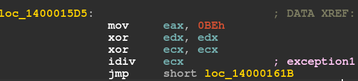{width="45%"} | 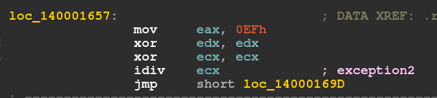{width="45%"}

(需要注意的是這邊將eax設定爲0xbe與0xef，稍後會用到)  

根據這條線索，先找到這個程式是如何定義Exception的處理方式:  
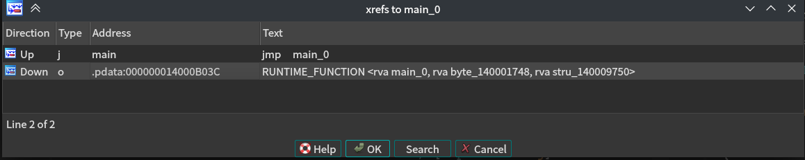  
繼續往下:  
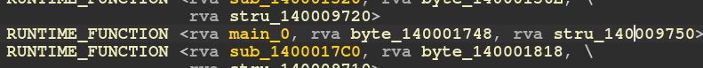  
就可以找到定義的位置  
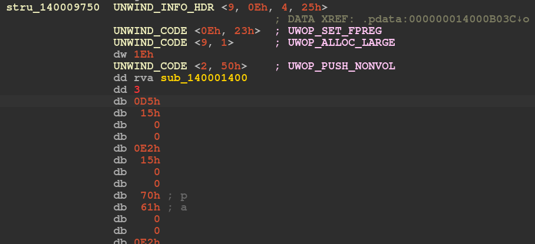  

------

接下來定義structure，以便檢視資訊:  
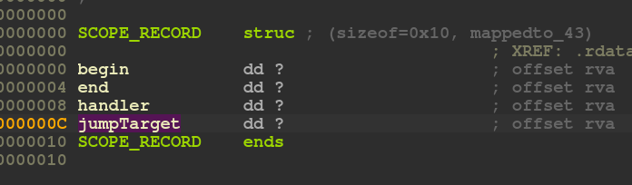  
  
定義好之後就可以轉成我們想要的資訊:  
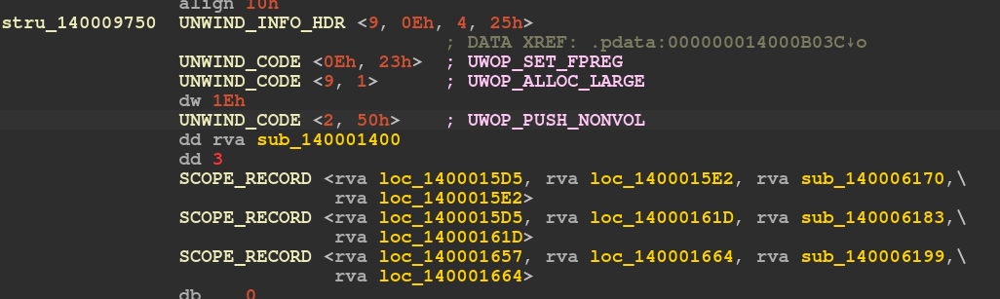  
  
其中，exception發生時並不會直接跳到target執行，而是先進入圖中sub_140001400執行，  
看看他做了什麼:  
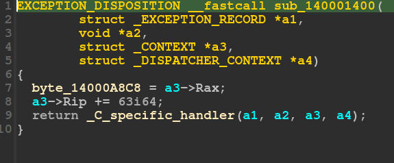  
這個function將當前rax的值存入14000A8C8中，並增加rip後執行正常的handler。  

而下面三個handler，每個都點進去，看看會做什麼事情:

140006170 | 140006183 | 140006199  
:--:|:--:|:--:  
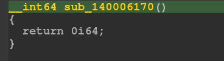{width="30%"} | 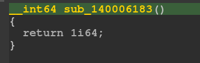{width="30%"} | 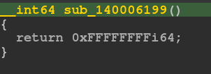{width="30%"}
回傳0，不做動 | 回傳1，執行handler | 回傳-1，繼續往下執行

## Exceptions
接下來，觀察兩個exception發生時分別會被哪些handler處理，  
第一個exception位置在1400015DE，因此在前兩個handler範圍內，但第一個handler不做動，  
因此直接到第二個執行，jump到14000161D執行:  
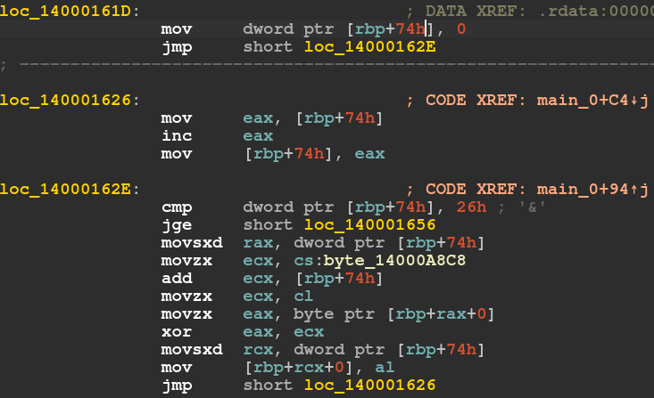  
根據我的理解，這些組合語言可以轉換成下面的pseudo code:  
```rust
for i in 0..26:
    ecx = 0xbe
    ecx += i
    ecx &= 255
    eax = input[i]
    eax ^= ecx
    input[i] = eax & 255
```

而第二個exception觸發後會從excpetion發生的位置繼續執行下去，也就是從140001662開始:  
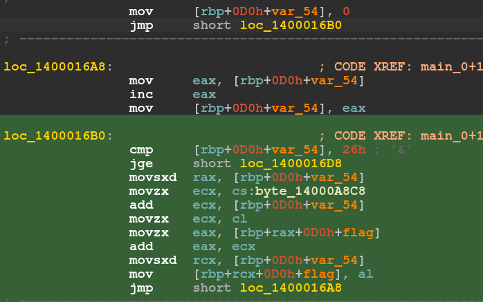  
跟上面的差不多，可以轉換成下面的pseudo code:  
```rs
for i in 0..26:
    ecx = 0xef
    ecx += i
    ecx &= 255
    eax = input[i]
    eax += ecx
    input[i] = eax & 255
```

## Solve
有了上面的資訊，就可以依照流程，寫出下面的C程式碼:
```c
#include <stdio.h>

const char ECX1 = 0xBE;
const char ECX2 = 0xEF;

int main() {
    char data[] = {0xe7, 0xe3, 0x72, 0x78, 0xac, 0x90, 0x90, 0x7c, 0x90,
                   0xac, 0xb1, 0xa6, 0xa4, 0x9e, 0xa7, 0xa2, 0xac, 0x90,
                   0xb9, 0xb2, 0xbf, 0xbb, 0xbd, 0xb6, 0xab, 0x90, 0xba,
                   0xb4, 0x90, 0xbf, 0xc0, 0xc0, 0xc4, 0xca, 0x95, 0xed,
                   0xc0, 0xb2, 0x00, 0x00, 0x00, 0x00, 0x00, 0x00, 0x00,
                   0x00, 0x00, 0x00, 0xff, 0xff, 0xff, 0xff};
    for (int i = 0; i < 0x26; i++) {
        data[i] -= (ECX2 + i);
    }
    for (int i = 0; i < 0x26; i++) {
        data[i] ^= (ECX1 + i);
    }
    printf("%s\n", data);
}
```

## Result
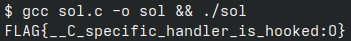{width="80%"}