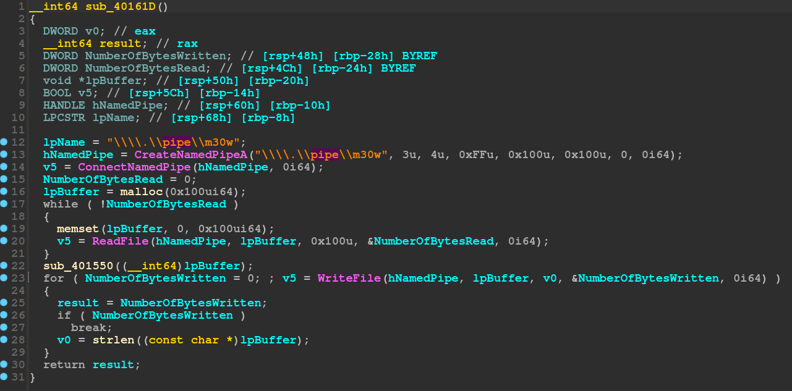

# meow
首先看到main:  
  

接下來一個function一個function看:  
先看第三個function，這邊看起來就是在做flag比對，但他的值明顯是被加密過的，不能直接拿來用，因此先去其他function看看。  
  

回去看第一個function:  
  
這邊主要是在做process hollowing，也就是把一個程式寫到記憶體中，讓他執行。  
而那個程式的來源就在這個程式的0x404040的位置。  
但他有一個function用來做XOR，也就是本來0x404040位置的資料是被加密過的。  
  

## dump
爲了取出exe檔，使用x64dbg先在decrypt完的地方設中斷點，再dump memory。  
  

設好中斷點後，繼續執行，直到程式要求輸入flag爲止。  
這邊需要輸入一個長度爲39的字串，因爲程式會先檢查flag長度，如果長度錯誤則後面都無法被執行到了。  
  

抵達中斷點後，按下Scylla的dump memory功能，將memory dump出來。  
起始位置在0x404040，長度則可以在decrypt_exe的function中看到，因此設成0x4000。  
  

## disassemble
dump出來後是一個新的PE執行檔，使用ida打開，看到main:  
  

點進function查看:  
  
可以看的出來這邊是在跟原本的程式使用NamedPipe溝通，回去對應到原本程式的第二個function:  
  

這兩個程式使用NamedPipe傳資料，傳的就是flag，而新的程式那邊又看到一個看起來是用來加密flag的地方:  
  
到這邊答案已經基本出來，只需要把資料還原回去即可。  

## summary
總結一下這個程式的行爲:  
1. 檢查flag長度正不正確
2. process hollowing
3. 跟hollow出來的程式溝通
4. 檢查flag是否正確(從hollow的程式傳回來的資料)

## solve
```py
data = [0x24, 0x1d, 0x1b, 0x31, 0x21, 0x0b, 0x4f, 0x0f, 0xe8, 0x50,
        0x37, 0x5b, 0x08, 0x40, 0x4a, 0x08, 0x1d, 0x11, 0x4a, 0xb8,
        0x11, 0x67, 0x3f, 0x67, 0x38, 0x14, 0x3f, 0x19, 0x0b, 0x54,
        0xb4, 0x09, 0x63, 0x12, 0x68, 0x2a, 0x45, 0x53, 0x0e, 0x01, 0x00]

key = [0x62, 0x57, 0x56, 0x76, 0x64, 0x77,
       0x3D, 0x3D, 0x87, 0x63, 0x0, 0x0, 0x0, 0x0, 0x0, 0x0]

for i in range(39):
    data[i] = data[i] - 2 * (i % 3)
    if data[i] < 0:
        data[i] += 0xff
    data[i] ^= key[i % 0xb]

flag = [chr(i) for i in data]
print("".join(flag))
```

## result

