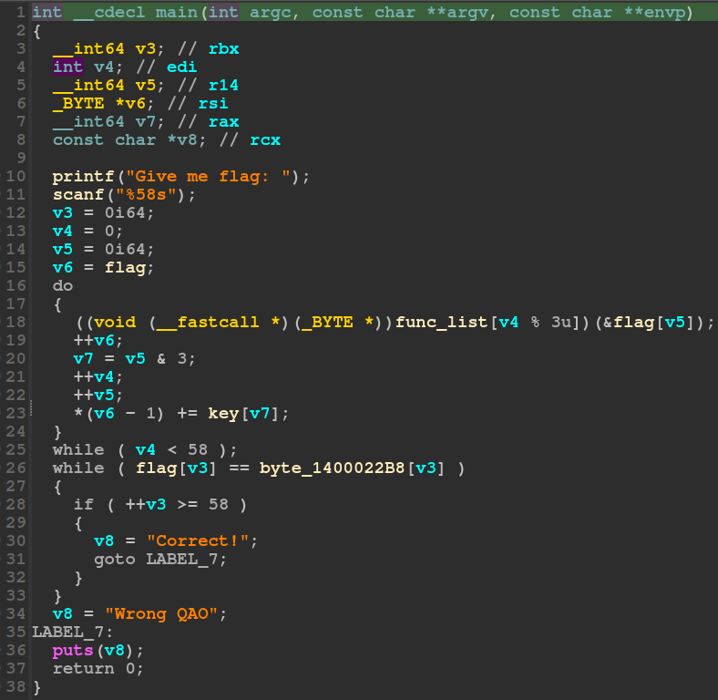
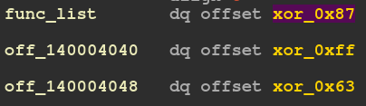
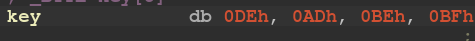
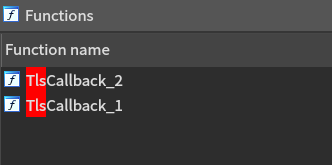
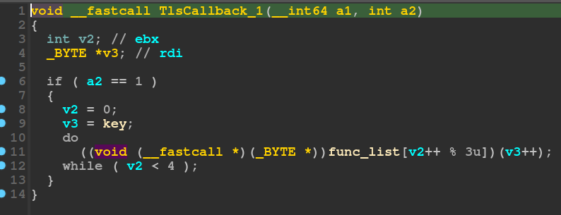
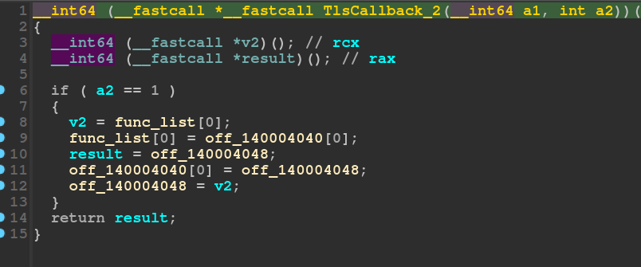
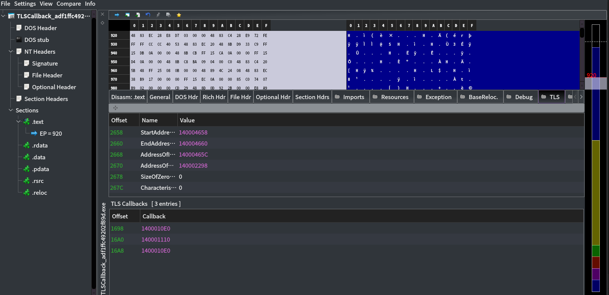
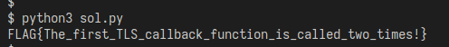

# TLS Callback
TLS(Thread-local storage)的callback是一個特別的entry point，會在main之前先被執行，是Windows下的API之一。

## Disassemble
這題使用IDA，首先看到main function:  
  

可以看到這個程式的邏輯很簡單，會對輸入的flag做某些function，再加上key之後跟某個data做比較，程式就結束了。  

func_list長度爲3，他們會做一些簡單的xor運算。  
  

key的長度爲4，放一些常數。  
  

但此時照著邏輯反推flag卻發現會是亂碼，尋找function list時會看到有兩個tls callback function，可以推斷是他們做了一些事情讓程式不如預期的執行。  


## callback function
看看這個程式的tls callback function做了什麼事情。  
  
  

首先，TlsCallback_1會把key裡面的值拿去給function做運算。  
而TlsCallback_2會把func_list裡面的東西做調換，有點像是rotate的感覺。  

至此已經可以知道前面無法正確推回flag的原因了，因爲這兩個tls callback function把很多東西都改過了。  
現在只需要去看看這兩個function是如何被呼叫的，以及他的順序，就可以正確解開了。  

## PE-bear
使用PE-bear可以觀察到，他是先執行了0x1400010E0的function(這對應到TlsCallback_2)，之後執行0x140001110的function(對應到TlsCallback_1)，再執行一次0x1400010E0的function。


## Solve
有了上面的資料，就可以寫出python程式來解出flag:  
```py
data = [0x46, 0x99, 0xf7, 0x64, 0x1d, 0x79, 0x44, 0x22, 0xc1, 0xd3, 0x27, 0xcd, 0x31, 0xc1, 0xd9,
        0x77, 0xec, 0x7a, 0x75, 0x24, 0xbf, 0xdd, 0x24, 0xdd, 0x23, 0xb2, 0xcd, 0x7c, 0x02, 0x58,
        0x46, 0x24, 0xac, 0xd8, 0x21, 0xd1, 0x5d, 0xbc, 0xc5, 0x7c, 0x05, 0x6c, 0x48, 0x2b, 0xbb,
        0xd5, 0x11, 0xcb, 0x35, 0xb6, 0xd9, 0x57, 0x0f, 0x60, 0x3f, 0x34, 0xff, 0xec, 0x00]


def xor_0x87(n): return n ^ 0x87
def xor_0xff(n): return n ^ 0xff
def xor_0x63(n): return n ^ 0x63


key = [0xde, 0xad, 0xbe, 0xbf]
func_list = [xor_0x87, xor_0xff, xor_0x63]


def tls_callback1():
    global key
    for i in range(4):
        key[i] = func_list[i % 3](key[i])


def tls_callback2():
    global func_list
    tmp = func_list[0]
    func_list[0] = func_list[1]
    func_list[1] = func_list[2]
    func_list[2] = tmp


tls_callback2()
tls_callback1()
tls_callback2()

v5 = 0
v6 = 0
for v4 in range(58):
    data[v6] = (data[v6] - key[v5 & 3]) % 256
    data[v5] = func_list[v4 % 3](data[v5])
    v5 += 1
    v6 += 1

flag = [chr(i) for i in data]
print("".join(flag))

```

## Result
執行結果:  
