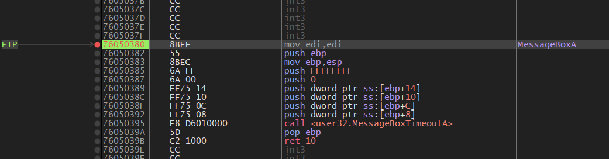

# A Message Box
這題是windows逆向工程的題目，因此使用x64dbg來分析。  
首先先試著執行程式，發現他會要求input flag，這邊先隨便給  
隨便給flag後跳出了一個提示視窗，說"wrong"  

## Windows API
跳出來的視窗，其實是Windows的API，是user32.dll中提供的  
因此，在x64dbg中，將相關的功能全部設定爲中斷點，就可以看到在視窗出現之前執行到哪裡。  
  

## Run
設好中斷點後接下來就是試著執行看看了。  
先執行到他可以輸入flag爲止，並隨便輸入一個flag後按enter:    
  

---
之後在x64dbg中點擊繼續執行，接著遇到了下一個中斷點:  
  
但這似乎不是我們要的，因此繼續往下執行  

---
接下來遇到的中斷點，應該會有有用的資訊，因爲是MessageBoxA的中斷點:  
  

找到了之後按x64dbg的call stack的tab，看看在執行到這邊之前是在哪裡:  
  
發現在MessageBoxA之前是在0095110B的地方，點兩下追蹤到該位置。  

---
到0095110B之後，可以看到一些關鍵的程式邏輯:  
  
最重要的就是這幾行:  
```asm
mov cl, byte ptr ds:[eax+9533C0]    ; "FLAG{fake_flag!!!!!!}"
rol cl, 3
xor cl, 87
cmp cl, byte ptr ds:[eax+953018]
jne ...
```
可以看的出來這邊就是在做比對了，因此只要找到資料位置，並還原出來就可以獲得flag了。  
額外補充的是，rol指令是rotate left的意思，也就是shift並將移出去的bits放到右邊。  

## Encrypted flag
追蹤到存放加密過的flag的位置，可以看到:  
  
雖然他解析成了指令，不過沒關係，這些二進位數值就是加密過的flag了。  

## Solve
依照上面的流程，寫出對應的python程式:  
```py
ror = lambda val, r_bits, max_bits: \
    ((val & (2**max_bits-1)) >> r_bits%max_bits) | \
    (val << (max_bits-(r_bits%max_bits)) & (2**max_bits-1))

a = [0xB5, 0xE5, 0x8D, 0xBD, 0x5C, 0x46, 0x36, 0x4E, 0x4E,
     0x1E, 0x0E, 0x26, 0xA4, 0x1E, 0x0E, 0x4E, 0x46, 0x06,
     0x16, 0xAC, 0xB4, 0x3E, 0x4E, 0x16, 0x94, 0x3E, 0x94, 0x8C,
     0x94, 0x8C, 0x9C, 0x4E, 0xA4, 0x8C, 0x2E, 0x46, 0x8C, 0x6C]
a = [i ^ 0x87 for i in a]
a = [ror(i, 0x3, 8) for i in a]
a = [chr(i) for i in a]

print("".join(a))
```

## Result
執行程式碼，可以得到結果:  
