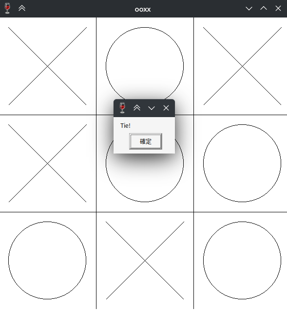
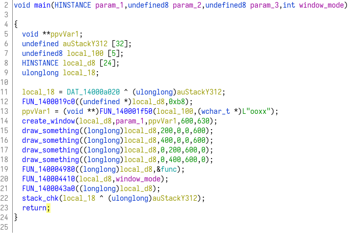
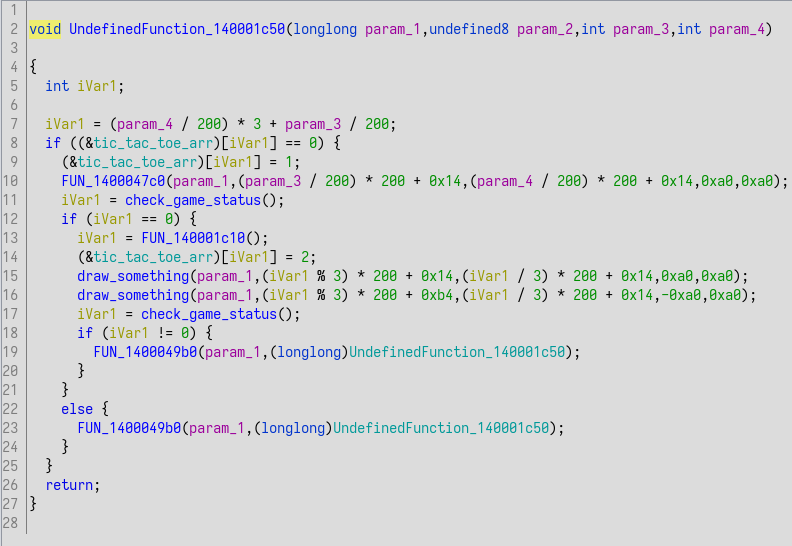
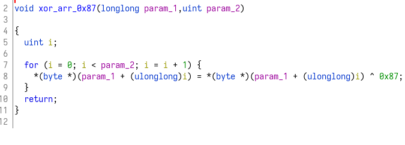
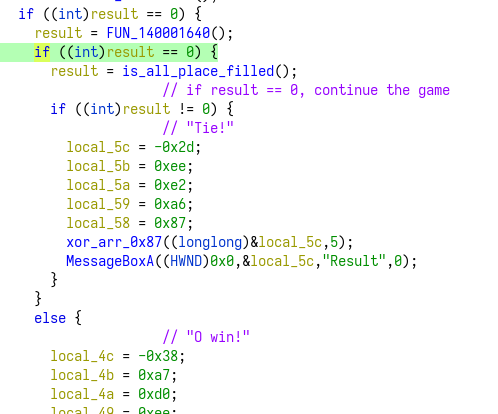
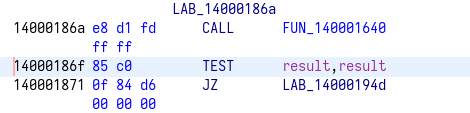
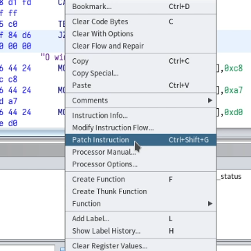
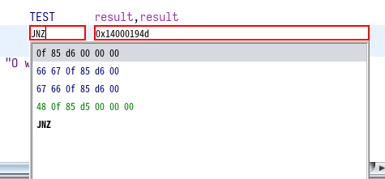
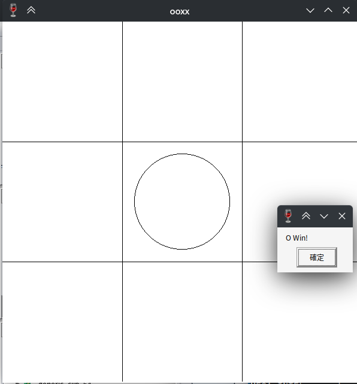
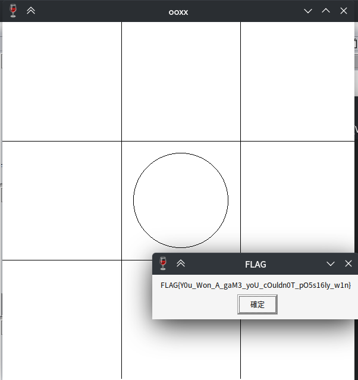

# ooxx
這個題目點開會是一個ooxx的遊戲，看起來只要獲勝就可以得到flag，  
但因爲對手似乎有使用minimax等演算法，因此不可能獲勝，頂多平手。  
{width="50%"}  

總共觀察出以下幾點:  
- 玩家爲O
- 玩家先行
- 無法獲勝
- 程式視窗的標題是ooxx
- 每回合判斷勝負

## reverse
這次使用ghidra，首先看到反編譯出的main function:  
  
根據程式執行的行爲，對一些function進行了分析與重新命名  

其中，找到了一個似乎是程式邏輯的function:  
  

深入檢查，可以找到一個function，就是在做獲勝與否，遊戲結束與否的判斷。  

## function check status
反編譯這個重要的function後，可以獲得下面的pseudo code:  
```c
void check_game_status(void)

{
  undefined8 result;
  undefined auStack184 [32];
  undefined4 local_98;
  undefined8 *local_90;
  void **local_88;
  undefined8 local_80 [4];
  undefined local_60;
  undefined local_5f;
  undefined local_5e;
  CHAR local_5c;
  undefined local_5b;
  undefined local_5a;
  undefined local_59;
  undefined local_58;
  CHAR local_54;
  undefined local_53;
  undefined local_52;
  undefined local_51;
  undefined local_50;
  undefined local_4f;
  undefined local_4e;
  CHAR local_4c;
  undefined local_4b;
  undefined local_4a;
  undefined local_49;
  undefined local_48;
  undefined local_47;
  undefined local_46;
  longlong local_40 [5];
  ulonglong local_18;
  
  local_18 = DAT_14000a020 ^ (ulonglong)auStack184;
  result = FUN_1400014d0();
  if ((int)result == 0) {
    result = FUN_140001640();
    if ((int)result == 0) {
      result = is_all_place_filled();
      if ((int)result != 0) {
                    // "Tie!"
        local_5c = -0x2d;
        local_5b = 0xee;
        local_5a = 0xe2;
        local_59 = 0xa6;
        local_58 = 0x87;
        xor_arr_0x87((longlong)&local_5c,5);
        MessageBoxA((HWND)0x0,&local_5c,"Result",0);
      }
    }
    else {
                    // "O win!"
      local_4c = -0x38;
      local_4b = 0xa7;
      local_4a = 0xd0;
      local_49 = 0xee;
      local_48 = 0xe9;
      local_47 = 0xa6;
      local_46 = 0x87;
      xor_arr_0x87((longlong)&local_4c,7);
      MessageBoxA((HWND)0x0,&local_4c,"Result",0);
      FUN_1400019c0((undefined *)local_40,0x28);
      FUN_1400031e0(local_40,(longlong)&DAT_14000a040);
      local_60 = 0xe6;
      local_5f = 0xe5;
      local_5e = 0x87;
      xor_arr_0x87((longlong)&local_60,3);
      local_90 = local_80;
      local_88 = (void **)FUN_140001fd0(local_90,&local_60);
      FUN_140002480(local_40,local_88,MessageBoxA_exref);
      local_98 = 1;
      nop();
    }
  }
  else {
                    // "X win!"
    local_54 = -0x21;
    local_53 = 0xa7;
    local_52 = 0xd0;
    local_51 = 0xee;
    local_50 = 0xe9;
    local_4f = 0xa6;
    local_4e = 0x87;
    xor_arr_0x87((longlong)&local_54,7);
    MessageBoxA((HWND)0x0,&local_54,"Result",0);
  }
  stack_chk(local_18 ^ (ulonglong)auStack184);
  return;
}
```
其中可以看出來應該有一些變數其實是array，但他沒有辨識出來。  
並且會將這些array賦予值之後進入一個function，點進去看這個function做的事情:  
  
可以看出來這應該是會將傳入的array每個元素都做xor 0x87，那就可以根據這個寫出還原的程式碼:  
```py
s = [0xd3, 0xee, 0xe2, 0xa6, 0x87]
s = [chr(i ^ 0x87) for i in s]
print("".join(s))

s = [0xc8, 0xa7, 0xd0, 0xee, 0xe9, 0xa6, 0x87]
s = [chr(i ^ 0x87) for i in s]
print("".join(s))

s = [0xdf, 0xa7, 0xd0, 0xee, 0xe9, 0xa6, 0x87]
s = [chr(i ^ 0x87) for i in s]
print("".join(s))
```

執行結果:  
```
Tie!
O Win!
X Win!
```

至此可以完全確定這邊就是判斷勝負，以及是否繼續進行遊戲的地方。  

## cheat
既然已經知道關鍵位置，那只需要繼續觀察 O Win! 的部分，應該就可以成功的解出flag  
但稍微看了一下後面的程式碼，似乎又呼叫了許多function，有點不容易trace，因此決定使用作弊的方式。  

## patch instruction
這邊是程式關鍵的判斷地方，判斷遊戲是否繼續執行:  
  
理論上只要能夠更改上圖中綠色的判斷條件，應該可以直接獲勝，免去後面的步驟。  

上面的程式碼對應到的組合語言部分:  
  

按下右鍵，選 patch instruction:  
  

並修改跳躍條件:  
  

修改完成後，將程式以PE格式匯出，就得到了一個patch過的程式。  

## solve
接下來只要執行程式，順利的話就可以無條件獲勝。  
  
  
成功解開。  