# pwn_myself
使用ghidra反編譯，首先看到main function:  
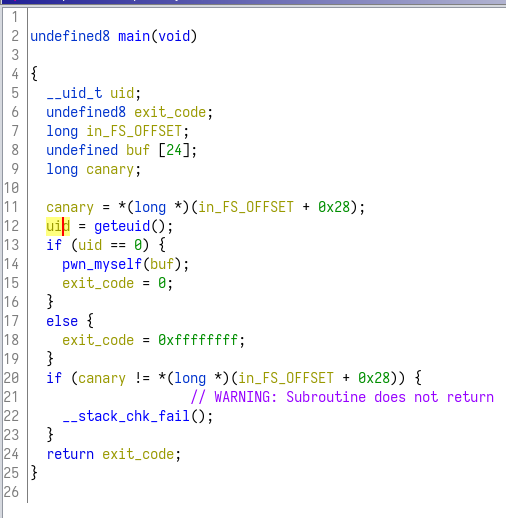  

首先分析一下他做了什麼事情:  
在第12行的地方呼叫了getuid()，也就是取得使用者id，並且做判斷，如果不等於0則直接離開，因此要讓程式跑起來，首先要用root來執行(id = 0)  

繼續往下看，進入(uid == 0)成立時會執行的function:  
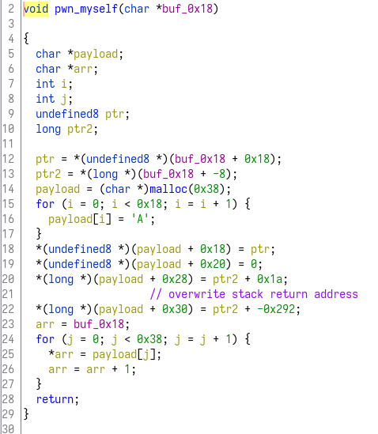  

這邊是在做pwn，藉由複寫stack上的return address，來跳躍到指定的地方去。  
這裡是原本的return address (0x166b51)  
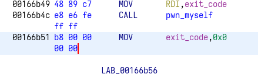  

然後他把這個位置改成 0x166b51 - 0x292 = 0x1668bf  
0x1668bf是一個function:  
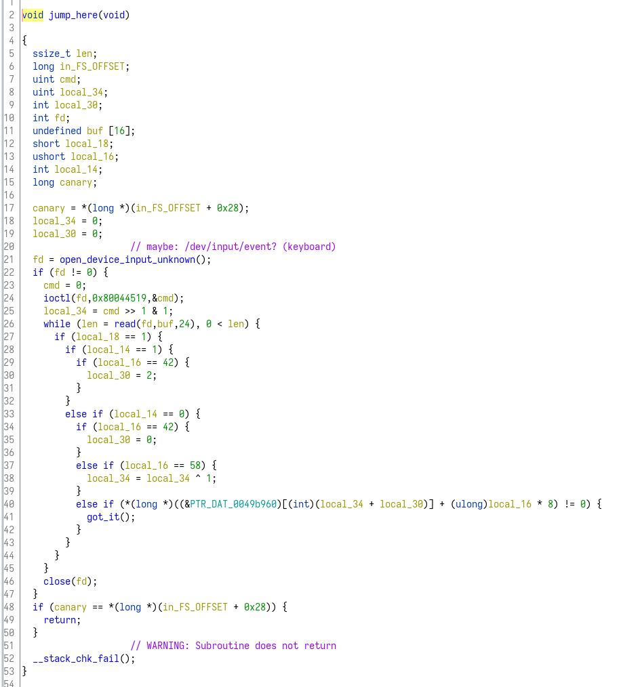  

## input
仔細往下追，先看open_device_input_unknown這個function:  
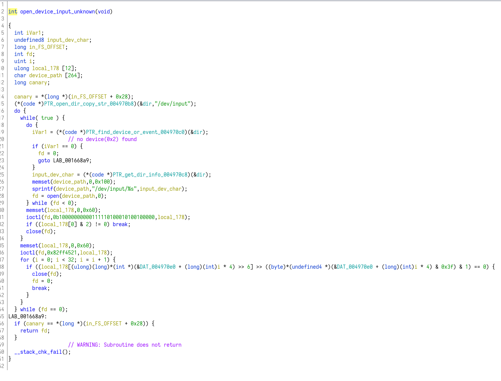  

這邊會去開一個檔案，路徑是/dev/input/eventX，這個路徑在Linux上是用來表達各種輸入的檔案(linux上萬物都是檔案)  
我不太確定這邊到底開的是哪一個，但用動態分析看的時候應該是截到keyboard的那個event。  

## Dynamic analysis
這邊使用PINCE做動態分析，看看程式執行的樣子。  
執行之後，他被read()這個function block住了，在等待輸入。  
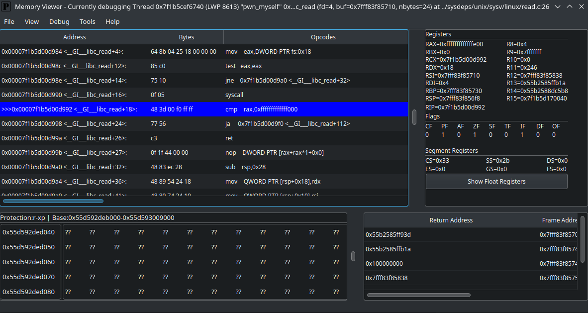  
這邊不太確定他要什麼輸入什麼東西，先往後面的function看  

## Correct ?
往下追幾個function:  
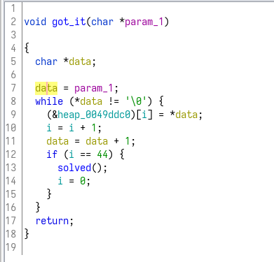  
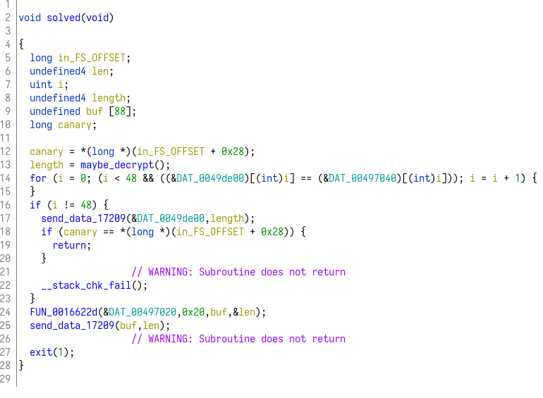  
我認爲這邊應該是當吃到正確的input時，會來執行的地方，所以應該很接近flag了。  

## OpenSSL
繼續往下追:  
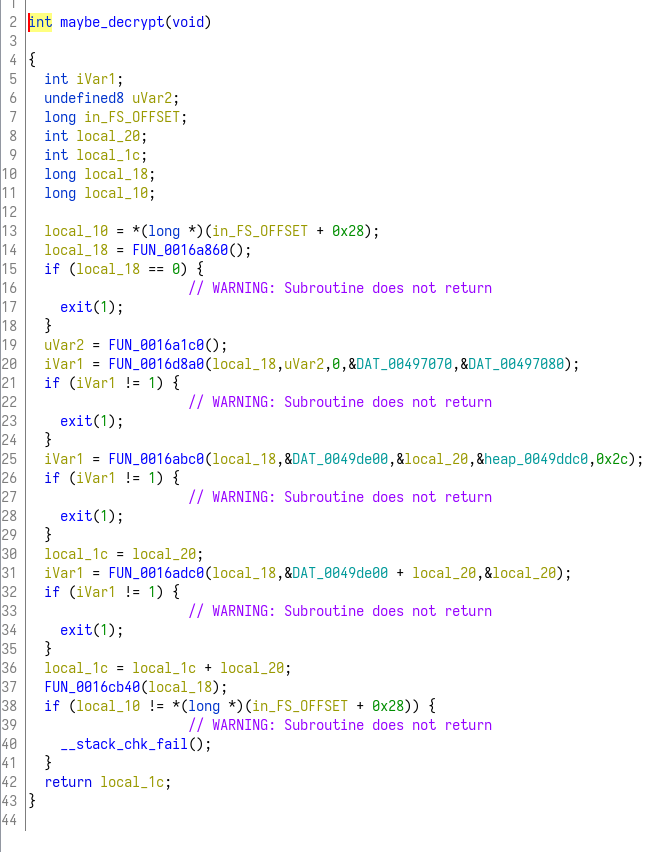  
這邊我認爲是在做解密的動作，因爲這幾個function往下點可以看到很多openssl相關的東西，例如:  
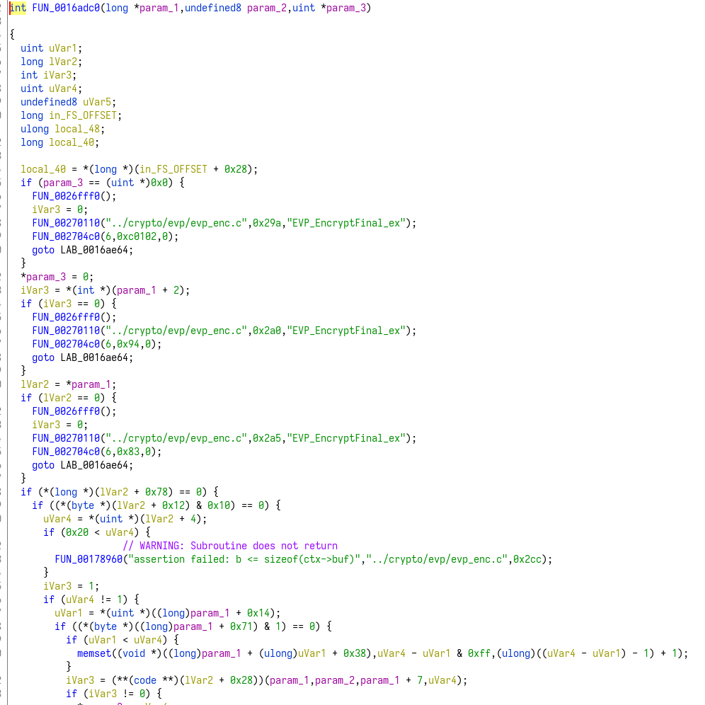  
很多字串應該是在解密失敗或者是一些錯誤的時候會列印出的東西，像是exception之類的(我的猜測)。  

## Socket
先假設已經解密完成，回到剛剛的地方(solved這個function)，往下可以看到一些送資料的程式碼:  
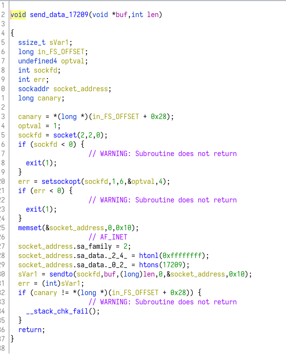  
這邊我猜就是已經把flag或者什麼資料解密完之後，用socket把資料送出去了，看起來是送到17209的port，然後是TCP。  

試著寫一點程式碼，看能不能收到資料:
```py
import socket

conn = socket.socket(socket.AF_INET, socket.SOCK_STREAM)
conn.bind(("localhost", 17209))
conn.listen(100)

while True:
    try:
        client, _ = conn.accept()
        while True:
            data = client.recv(100)
            print(data)
    except Exception as err:
        print(err)
```
結果不論按什麼鍵，都沒能收到資料

## What do you want?
即便看了很多個function，最終還是不知道read那邊他究竟想要什麼東西，也許是要按照一定的順序按鍵盤?(直接在鍵盤上打flag?)  
雖然很多想法，但一些地方無法正確理解，解題失敗。
