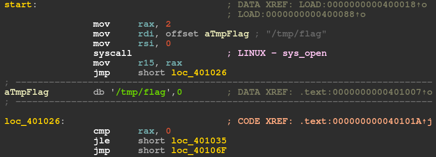
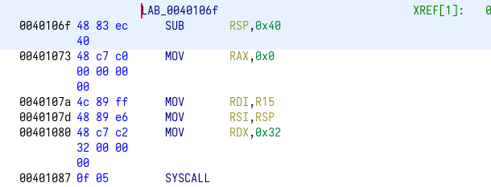
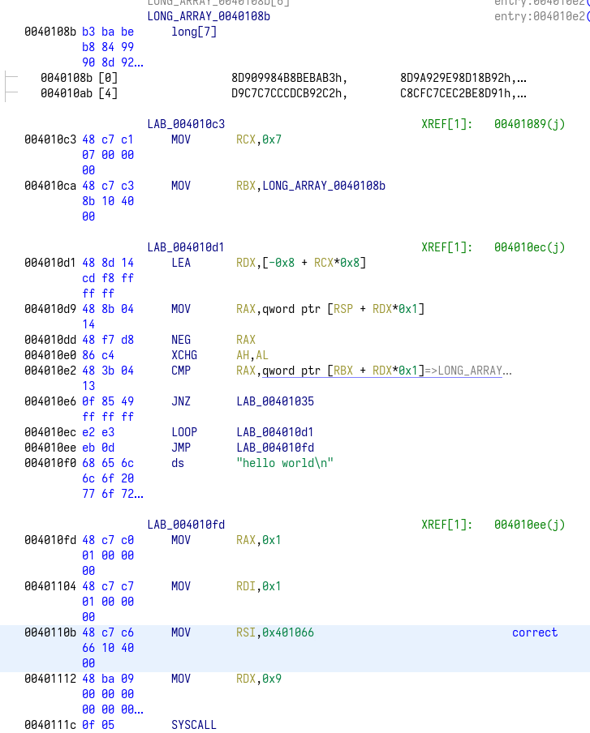
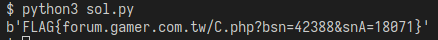

# sacred arts
題目是一個執行檔，使用IDA反組譯題目。

## start
首先觀察程式進入點  
  

首先可以看到在start一開始的地方做了一個syscall，  
根據 `mov rax, 2` 可以知道這是 syscall open，  
以及根據 `mov rdi, (offset) aTmpFlag` 可以得知路徑爲"/tmp/flag"  
<br>
做完syscall open後，他會做syscall read，讀長度爲0x32的資料  
  

繼續往下走，結果就看到了核心邏輯:  
  

這邊ghidra沒能反編譯出來，但根據我自己的理解，反編譯成下面的pseudo code:  
```c
uint64_t arr[] = {0x8D909984B8BEBAB3, 0x8D9A929E98D18B92,
                  0xD0888BD19290D29C, 0x8C9DC08F978FBDD1,
                  0xD9C7C7CCCDCB92C2, 0xC8CFC7CEC2BE8D91,
                  0xFFFFFFFFFFFFCF82};

scanf("%s", &flag);
for (int i = 7; i != 0; i--) {
    uint64_t rax = arr[i];
    rax = -rax;
    __asm__("xchg ah, al");
    if (rax != flag[i]) {
        puts("wrong");
        return;
    }
}
puts("correct");
```

## Solve
根據上面的pseudo code，寫程式去還原flag
```py
from Crypto.Util.number import long_to_bytes

long_arr = [0x8D909984B8BEBAB3, 0x8D9A929E98D18B92,
            0xD0888BD19290D29C, 0x8C9DC08F978FBDD1,
            0xD9C7C7CCCDCB92C2, 0xC8CFC7CEC2BE8D91,
            0xFFFFFFFFFFFFCF82]

flag = b""
for rax in long_arr:
    # xchg al, ah
    al = rax & 0xFF   # extract al (7-0 bit)
    ah = (rax & 0xFF00) >> 8  # extract ah (15-8 bit)

    rax &= 0xFFFFFFFFFFFF0000  # clear al and ah

    al, ah = ah, al  # xchg
    rax |= al  # set al
    rax |= (ah << 8)  # set ah

    # neg rax
    rax = rax ^ 0xFFFFFFFFFFFFFFFF

    flag += long_to_bytes(rax)[::-1]  # little endian

print(flag)
```

## Result
