# trace
首先試著執行題目的檔案    
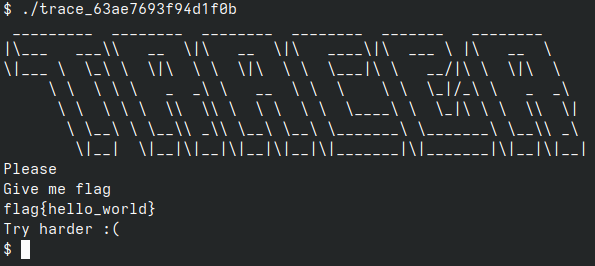  
似乎沒有什麼有用的資訊  

## Decompile
使用ghidra反組譯  
首先先找到entry，然後跟着entry到main  
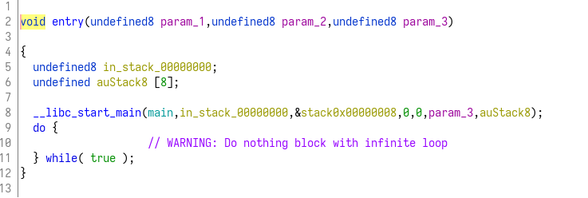  
main:  
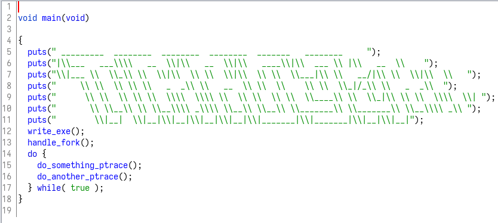  

繼續跟著看到呼叫的第一個function write_exe()  
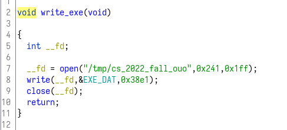  
發現他開了一個檔案，路徑在/tmp/cs_2022_fall_ouo並寫入資料  

因此嘗試執行這個執行檔，並成功在/tmp內找到檔案  
同時，執行file指令發現是一個執行檔  
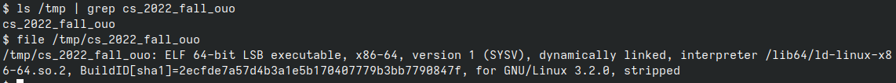

## cs_2022_fall_ouo
entry:  
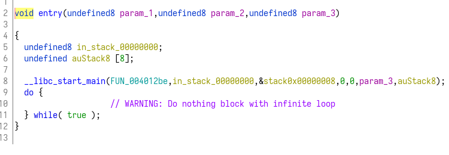  

跟著往下走  
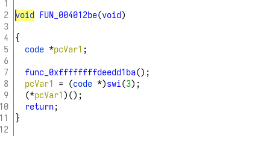  
結果無法繼續追蹤，因爲不存在func_0xffffffffdeedd1ba這個位置  

## Discovery
瀏覽整個反組譯過的程式，在0x004011d8看到了一些資料  
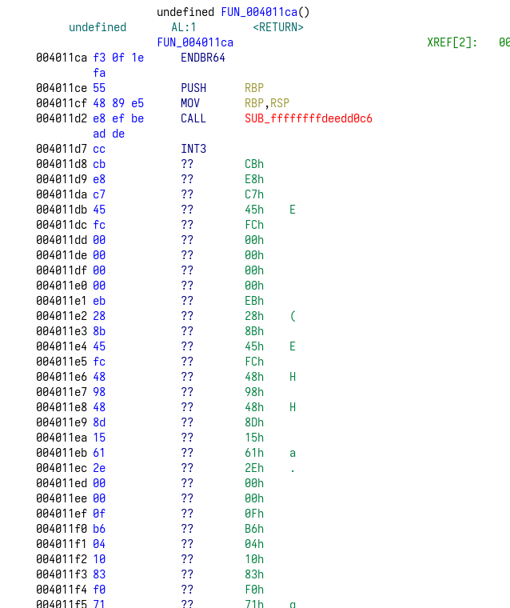  
但看起來怪怪的，因此試着disassemble看看  
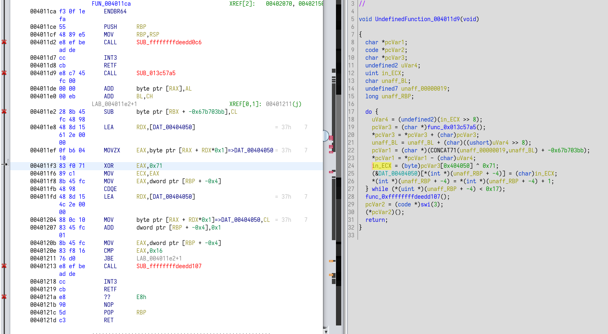  
結果成功解出東西。  
但沒有看的很懂，因此繼續往後找  

---
在0x00401242又看到了一些不明資料，嘗試disassemble  
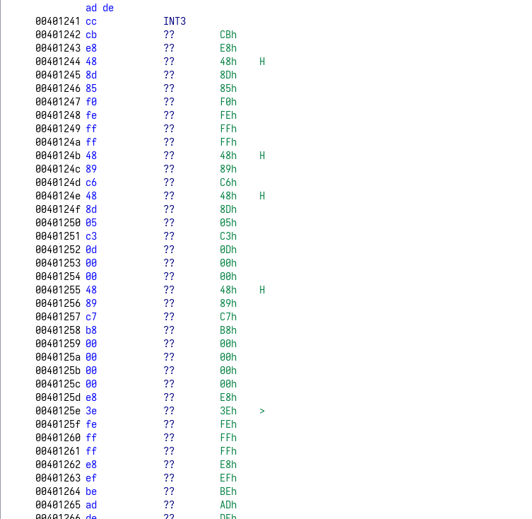  
結果也成功解出東西，下面是解碼出來的組合語言。  
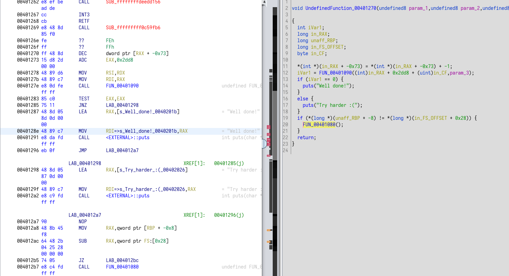  
雖然出現了一些題目關鍵的字串，但沒有看的很懂，因此繼續往後找  

### Suspicious data
在0x00404050位置發現可疑的資料  
因爲出現很多printable的ascii以及最後一個byte是0x00，長度也算合理，因此猜測是flag  
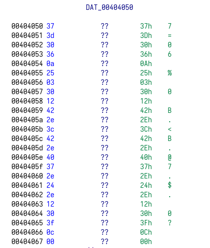  

使用ghidra的功能尋找這個位置的reference  
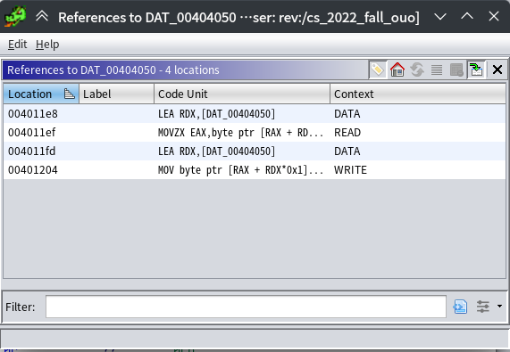  
結果在剛才disassemble的地方找到reference  
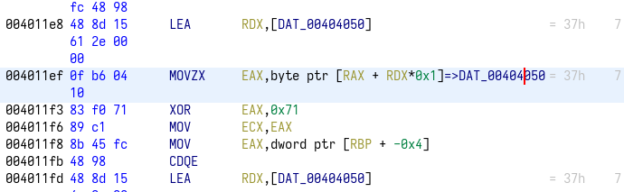  

這邊反編譯出的程式碼如下:  
```c

// WARNING: Instruction at (ram,0x004011e3) overlaps instruction at (ram,0x004011e2)
// 

void UndefinedFunction_004011d9(void) {
  char *pcVar1;
  code *pcVar2;
  char *pcVar3;
  undefined2 uVar4;
  uint in_ECX;
  char unaff_BL;
  undefined7 unaff_00000019;
  long unaff_RBP;
  
  do {
    uVar4 = (undefined2)(in_ECX >> 8);
    pcVar3 = (char *)func_0x013c57a5();
    *pcVar3 = *pcVar3 + (char)pcVar3;
    unaff_BL = unaff_BL + (char)((ushort)uVar4 >> 8);
    pcVar1 = (char *)(CONCAT71(unaff_00000019,unaff_BL) + -0x67b703bb);
    *pcVar1 = *pcVar1 - (char)uVar4;
    in_ECX = (byte)pcVar3[0x404050] ^ 0x71;
    (&DAT_00404050)[*(int *)(unaff_RBP + -4)] = (char)in_ECX;
    *(int *)(unaff_RBP + -4) = *(int *)(unaff_RBP + -4) + 1;
  } while (*(uint *)(unaff_RBP + -4) < 0x17);
  func_0xffffffffdeedd107();
  pcVar2 = (code *)swi(3);
  (*pcVar2)();
  return;
}
```

雖然整段程式碼非常雜亂很難看懂，仍舊看到了一行關鍵程式碼:  
`in_ECX = (byte)pcVar3[0x404050] ^ 0x71;`  
抱著疑心，把0x404050的位置的資料全部拿去XOR 0x71試看看  

## Solve
使用python協助做XOR  
```py
data = [0x37, 0x3d, 0x30, 0x36, 0x0a, 0x25, 0x03, 0x30, 0x12, 0x42, 0x2e, 0x3c,
        0x42, 0x2e, 0x40, 0x37, 0x2e, 0x24, 0x2e, 0x12, 0x30, 0x3f, 0x0c, 0x00]
res = [chr(i ^ 0x71) for i in data]
print("".join(res))
```
執行結果:  
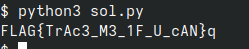  
找到flag了。
