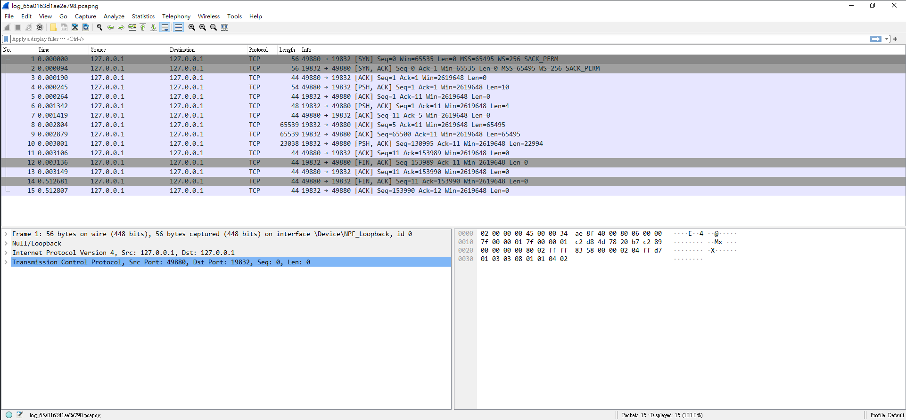
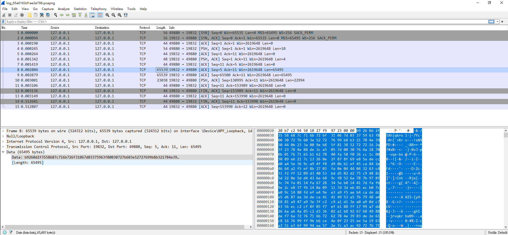
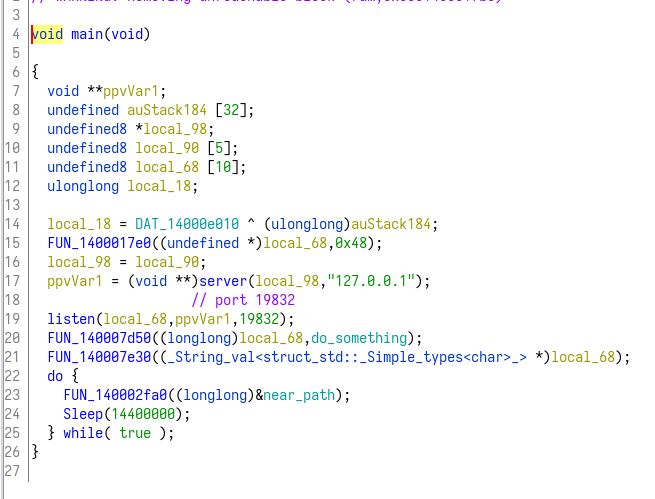
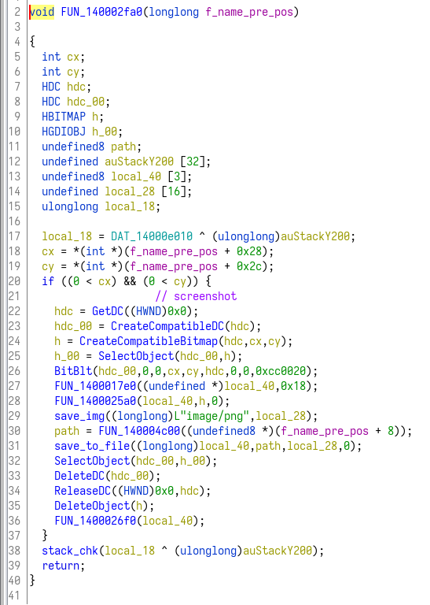
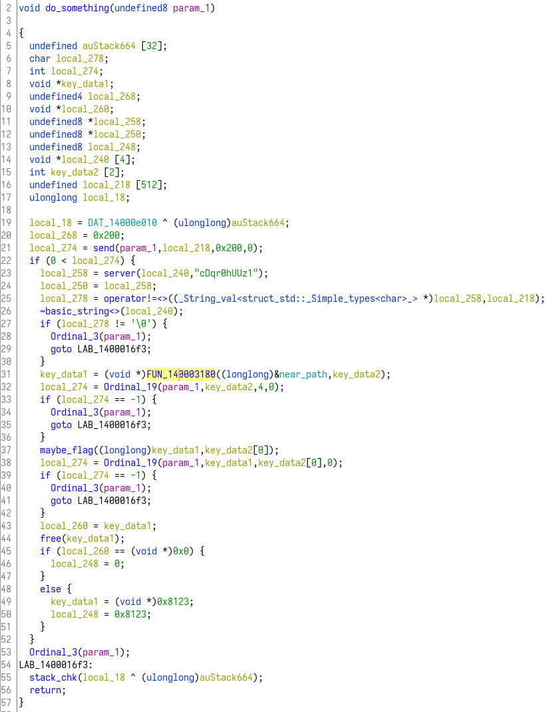
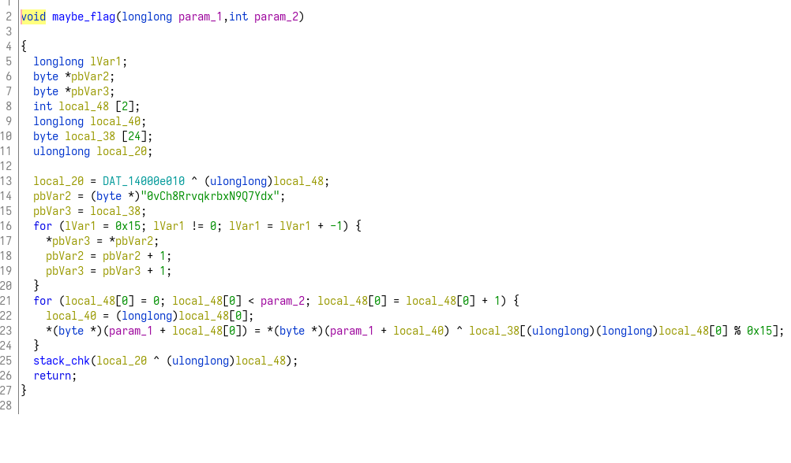
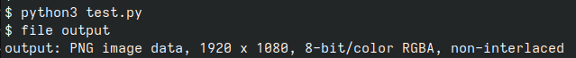

# trojan
題目給了兩個檔案，一個是執行檔，一個是wireshark的檔案。  

## pcapng
使用wireshark打開這個檔案看看他有什麼內容:  
  
可以看到傳了一些封包，其中有幾個比較大的封包，點進去看看內容是什麼:  
  
看起來似乎是一些資料，但被加密過了，沒辦法看到想要的內容  

## reverse
看記錄檔無法看出什麼資訊，因此來看看反編譯出的main function，這邊根據理解已經對一些function重新命名過  
  

看起來這邊是在建立socket連線，然後程式就會在後臺掛著，每隔14400秒做一次事情。  
點進去看看這個function實際上在做什麼。  
  

GetDC這個function是Windows的API，給與參數0代表是做螢幕截圖，到這邊可以推斷剛才wireshark內比較大的封包應該就是一張截圖，現在要想辦法還原出那張圖片來獲得更多有用的資訊。  
可以推測題目之所以叫trojan，就是因爲這個程式模仿了一個木馬的行爲，只是資料是送到本機端。  

## send
回到main function，跳到do_something的function內，看看做了什麼事情:  
  
仔細看過之後我覺得這邊應該是在處理送資料的部分。  

## encrypt
繼續往下觀察，可以看到一個可疑的function，裡面做了XOR運算，大致可以猜測他是對輸入的參數(指標)做加密。  
  

## decrypt
跟著這個想法，試著將wireshark抓到的資料拿出來，照著他的流程嘗試拿來解密。  
```py
with open("data", "r") as f:
    data = f.read()

# split data to bytes
data = [data[i:i+2] for i in range(0, len(data), 2)]

x = "0vCh8RrvqkrbxN9Q7Ydx"
x = [ord(i) for i in x]
x.append(0) # '\0' in C str

data = [int(i, base=16) for i in data]

for i, v in enumerate(data):
    data[i] = v ^ x[i%0x15]

with open("output", "wb") as f:
    f.write(bytes(data))
```

## solve
執行上面的程式，並觀察output，是一張圖片，裡面有flag:  
  
  
