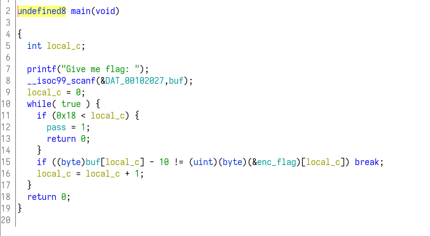
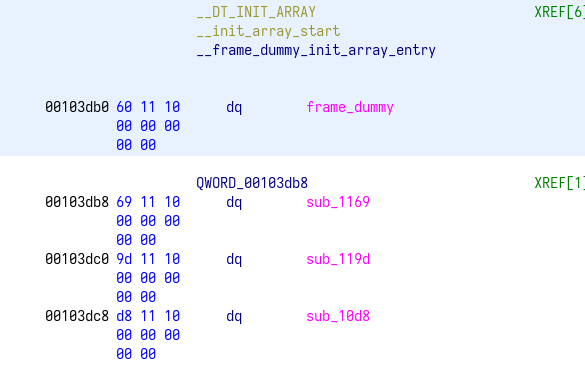
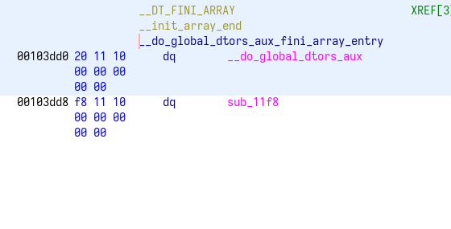
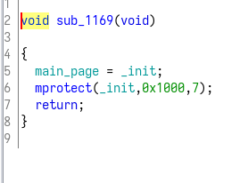
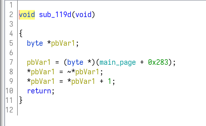
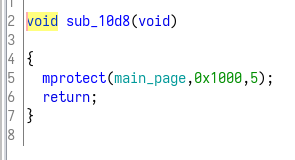
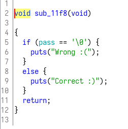
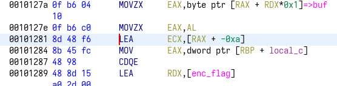
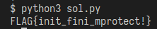

# why
使用ghidra反編譯，首先看到main:  
  

## solve(failed)
這個main的邏輯非常簡單，直接寫程式嘗試解密flag:  
```py
data = [0x50, 0x56, 0x4b, 0x51, 0x85, 0x73, 0x78, 0x73, 0x7e, 0x69, 0x70, 0x73,
        0x78, 0x73, 0x69, 0x77, 0x7a, 0x7c, 0x79, 0x7e, 0x6f, 0x6d, 0x7e, 0x2b, 0x87]
flag = [chr(i+10) for i in data]
print("".join(flag))
```
結果程式跑出一堆亂碼，看來程式其他部分有做了什麼事情，讓這個題目不如看起來的簡單。  

## init / fini
init與fini是程式的兩個特別的部分，init會在entry之前被執行，而fini則是在程式離開前最後會被執行。  
來看看這個程式的init與fini分別做了什麼:  
  


### init
>   

把main_page設成_init的位置，其中_init的位置是0x101000。
使用mprotect把_init後0x1000的記憶體位置改成可寫入

> 

把main_page+0x283的位置做neg(二補數)運算

> 

使用mprotect把_init後0x1000的記憶體位置改回可執行

### fini
> 

這邊就是沒有在main看到的output

init改了0x101000 + 0x283位置的記憶體，所以看到0x101283是什麼東西:  
  

他把f6改掉了，改成f6的二補數，也就是會從-0xa變成0xa，這也是爲什麼一開始解題的程式碼是錯誤的，要改成減。  

## solve
已經找到原因，稍微修改程式碼:
```py
data = [0x50, 0x56, 0x4b, 0x51, 0x85, 0x73, 0x78, 0x73, 0x7e, 0x69, 0x70, 0x73,
        0x78, 0x73, 0x69, 0x77, 0x7a, 0x7c, 0x79, 0x7e, 0x6f, 0x6d, 0x7e, 0x2b, 0x87]
flag = [chr(i-10) for i in data]
print("".join(flag))
```

